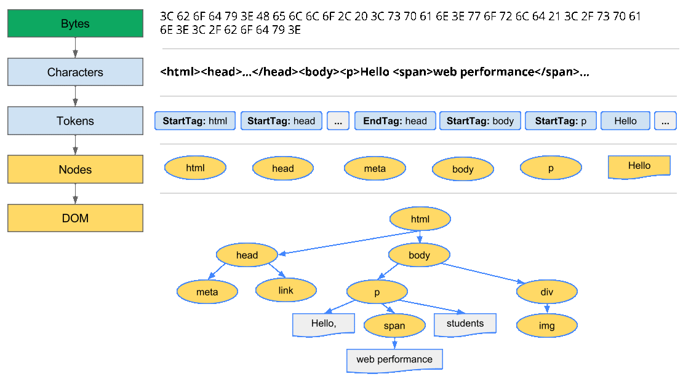

# 浏览器系列

## 浏览器内核
| 浏览器/RunTime | 内核（渲染引擎） | JavaScript 引擎 |
| :-:| :-: | :-: |
| Chrome | Blink（28~）Webkit（Chrome 27） | V8 |
| FireFox | Gecko | SpiderMonkey |
| Safari | Webkit | JavaScriptCore |
| Edge | EdgeHTML | Chakra(for JavaScript) |
| IE | Trident | Chakra(for JScript) |
| Node.js | - | Node.js |

## 浏览器渲染机制

### 渲染流程
1. 浏览器获取HTML文件，然后对文件进行解析，形成DOM Tree
2. 与此同时，进行CSS解析，生成Style Rules
3. 接着将DOM Tree 与 Style Rules 合成为 Render Tree
4. 接着进入布局（Layout）阶段，也就是为每个节点分配一个应该出现在屏幕上的确切坐标
5. 随后调用GPU进行绘制（Paint） 遍历Render Tree 的节点，将元素呈现出来

webkit 具体流程如图


### DOM Tree的创建

DOM 是以 `Bytes -> Characters -> Tokens -> Nodes -> DOM` 这样的流程生成的。如下图所示：



1. 当服务器返回HTML文件给浏览器的时候，浏览器接收到的是一些字符数据

2. 然后浏览器根据相应的编码模式，解析字节数据得到字符。如果这时候编码方式和文件字节编码不一致就会出现乱码

3. 浏览器再根据DTD中的对元素（标签）的定义，对这些字符进行语义化（Token）

4. 浏览器使用这些语义块（Token） 创建对象，形成一个个节点

5. HTML解析器就会从HTML文件的头部到尾部，一个个地遍历这些节点。这时会遇到一些情况：
      * 当遇到普通节点就会直接加入DOM树；
      * 当节点是JS代码会将控制权交给JS解析器；
      * 当节点是CSS代码会将解析权交给CSS解析器；
      * 当外联的JS代码和CSS代码还没从服务器传到浏览器的时候，如果DOM树上有可视元素的话，浏览器通常会选择将一些内容提前渲染到屏幕上。

6. 当HTML解析器读到最后一个节点的时候，整个DOM树也构建完成了，这个时候就会触发domContentloaded事件。

### Render Tree

当 DOM 和 CSSOM 构建完成，一个存储了节点信息，一个存储了节点渲染信息，都不能直接用来渲染，浏览器将两者结合，生成渲染树 Render Tree，这棵树包含了页面所有可见元素及其渲染信息。如下图所示


生成渲染树，浏览器做了这些：
1. 从DOM的根节点开始，遍历每个可视节点;script、link、meta都属于不可视节点，另外，display: none的节点也属于不可视节点
2. 从CSSOM中搜索可视节点的样式
3. 计算这些样式，将计算值应用到可视节点上

### 布局和渲染
渲染树生成后，浏览器便可以根据渲染树中的样式信息，结合设备的屏幕信息，计算每个元素的位置和尺寸。得到了渲染树及其节点的布局信息，浏览器便可以将最终的页面渲染到屏幕。

对于渲染我们还需要知道一个概念：设备刷新率

设备刷新率是设备屏幕渲染的频率60HZ 也就是屏幕在1s内渲染60次，约16.7ms渲染一次屏幕。这就意味着，我们的浏览器最佳的渲染性能就是所有的操作在一帧16.7ms内完成。

### 重绘（Repaint）和回流（Reflow）

重绘和回流是渲染步骤中的一小节，但是这两个步骤对于性能影响很大。

**重绘**：当节点需要更改外观而不会影响布局的，比如改变color属性

**回流**：元件的几何尺寸变了，我们需要重新验证并计算Render Tree 。回流也被称为重排

#### 引发回流的操作：

* 页面初始渲染
* 改变字体，改变元素尺寸（宽高、内外边距、边框、元素位置）
* 改变元素内容（文本、图片、输入框输入文字等）
* 添加、删选可见DOM元素 （注意：如果是删除本身就display:none的元素不会发生回流；visibility:hidden的元素显示或隐藏不影响回流）
* 浏览器窗口变化 滚动或缩放
* 伪类样式激活

回流必定会发生重绘，重绘不一定会引发回流。回流所需的成本比重绘高的多，改变深层次的节点很可能导致父节点的一系列回流，所以我们需要减少回流。

#### 避免重绘与回流

* 使用 translate 替代 top
* 使用 visibility 替换 display: none ，因为前者只会引起重绘，后者会引发回流（改变了布局）
* 把 DOM 离线后修改，比如：先把 DOM 给 display:none (有一次 Reflow)，然后你修改 100 次，然后再把它显示出来
* 要把 DOM 结点的属性值放在一个循环里当成循环里的变量
* 将频繁运行的动画变为图层，图层能够阻止该节点回流影响别的元素。比如对于 video 标签，浏览器会自动将该节点变为图层
* 集中改变样式
* 使用DocumentFragment

我们可以通过createDocumentFragment创建一个游离于DOM树之外的节点，然后在此节点上批量操作，最后插入DOM树中，因此只触发一次重排
```
var fragment = document.createDocumentFragment();

for (let i = 0;i<10;i++){
  let node = document.createElement("p");
  node.innerHTML = i;
  fragment.appendChild(node);
}

document.body.appendChild(fragment);
```

#### 图层

一般来说，可以把普通文档流看成一个图层。特定的属性可以生成一个新的图层。不同的图层渲染互不影响，所以对于某些频繁需要渲染的建议单独生成一个新图层，提高性能。但也不能生成过多的图层，会引起反作用。

通过以下几个常用属性可以生成新图层

* 3D 变换：translate3d、translateZ
* will-change
* video、iframe 标签
* 通过动画实现的 opacity 动画转换
* position: fixed

### Load 和 DOMContentLoaded 区别
Load 事件触发代表页面中的 DOM，CSS，JS，图片已经全部加载完毕。

DOMContentLoaded 事件触发代表初始的 HTML 被完全加载和解析，不需要等待 CSS，JS，图片加载


## 跨域

### 跨域的产生

因为浏览器有一种安全机制叫做同源策略。

同源策略是一种约定，它是浏览器最核心也最基本的安全功能，如果缺少了同源策略，浏览器很容易受到XSS、CSRF等攻击。所谓同源是指"协议+域名+端口"三者相同，即便两个不同的域名指向同一个ip地址，也非同源。


同源策略限制内容有：
* Cookie、LocalStorage、IndexedDB 等存储性内容
* DOM 节点
* AJAX 请求发送后，结果被浏览器拦截了

以下三个标签可以不受限制：

* ``
* `<link href=XXX>`
* `<script src=XXX>`

### 跨域的解决

#### JSONP

JSONP 是 JSON with padding的简写. JSONP本质上是一个Hack，它利用`<script>`标签不受同源策略限制的特性进行跨域操作。由两部分组成:回调函数和数据。回调函数是当响应到来时应该在页面中调用的函数。回调 函数的名字一般是在请求中指定的。而数据就是传入回调函数中的 JSON 数据。下面是一个典型的 JSONP 请求。

```
<script src="http://domain/api?callback=jsonp"></script>
```
优点：
1. 实现简单
2. 兼容性非常好

缺点：

1. 只支持get请求（因为`<script>`标签只能get）
2. 有安全性问题
3. 需要服务端配合jsonp进行一定程度的改造

#### CORS

跨域资源共享(CORS) 是一种机制，它使用额外的 HTTP 头来告诉浏览器  让运行在一个 origin (domain) 上的Web应用被准许访问来自不同源服务器上的指定的资源。

CORS 需要浏览器和后端同时支持。服务端设置 Access-Control-Allow-Origin 就可以开启 CORS。

#### Nginx

使用nginx反向代理实现跨域，是最简单的跨域方式。只需要修改nginx的配置即可解决跨域问题，支持所有浏览器，支持session，不需要修改任何代码，并且不会影响服务器性能。

## 本地存储

## 浏览器缓存

缓存按缓存策略来分可以分为**强制缓存**和**协商缓存**

### 强制缓存

强制缓存直接减少请求数，是提升最大的缓存策略。 如果考虑使用缓存来优化网页性能的话，强制缓存应该是首先被考虑的。可以造成强制缓存的字段是 Cache-control 和 Expires。

#### Expires

Expires 是 HTTP 1.0 的字段，表示缓存到期时间。 在Response Headers中，在响应http请求时告诉浏览器在过期时间前浏览器可以直接从浏览器缓存取数据，而无需再次请求。例如 Expires: Thu, 10 Nov 2019 08:45:11 GMT

但是该字段具有以下缺点：

* 由于服务器返回的时间是绝对时间，用户如果对本地时间进行修改，从而导致浏览器判断缓存失效，重新请求该资源。或者不考虑修改，客户端与服务器端时间可能存在时差或者误差。


#### Cache-control

在HTTP/1.1中，Cache-Control是**最重要**的规则，主要用于控制网页缓存。例如：Cache-control: max-age=60*5。

Cache-control 常用字段：[完整属性列表](https://developer.mozilla.org/zh-CN/docs/Web/HTTP/Headers/Cache-Control)

* max-age 设置缓存存储的最大周期，超过这个时间缓存被认为过期(单位秒)。与Expires相比，时间使用的是相对于请求发起的时间。
* no-cache 在发布缓存副本之前，强制要求缓存把请求提交给原始服务器进行验证(协商缓存验证)。
* no-store 缓存不应存储有关客户端请求或服务器响应的任何内容，即不使用任何缓存。
* public 表明响应可以被任何对象（包括：发送请求的客户端，代理服务器，等等）缓存，即使是通常不可缓存的内容。
* private 表明响应只能被单个用户缓存，不能作为共享缓存（即代理服务器不能缓存它）。私有缓存可以缓存响应内容，比如：对应用户的本地浏览器。
* must-revalidate 一旦资源过期（比如已经超过max-

这些值可以混合使用。在混合使用时，它们的优先级如下图:


注意 在 HTTP/1.1 之前，如果想使用 no-cache，通常是使用 Pragma 字段，如 Pragma: no-cache(这也是 Pragma 字段唯一的取值)。

自从 HTTP/1.1 开始，Expires 逐渐被 Cache-control 取代。Cache-control 是一个相对时间，即使客户端时间发生改变，相对时间也不会随之改变，这样可以保持服务器和客户端的时间一致性。而且 Cache-control 的可配置性比较强大。

Cache-control 的优先级高于 Expires，为了兼容 HTTP/1.0 和 HTTP/1.1，实际项目中两个字段都会设置。

### 协商缓存

当强制缓存失效(超过规定时间)时，就需要使用协商缓存，由服务器决定缓存内容是否失效。

协商缓存在请求数上和没有缓存是一致的，但如果是 304 的话，返回的仅仅是一个状态码而已，并没有实际的文件内容，因此 在响应体体积上的节省是它的优化点。

协商缓存主要通过两组Http Header 值实现 `Last-Modified & If-Modified-Since` 和 `ETag & If-None-Match`

#### Last-Modified & If-Modified-Since

1. 服务器端在Response Header 中 `Last-Modified`字段告知客户端，资源最后一次被修改的时间，例如 `Last-Modified: Mon, 10 Nov 2018 09:10:11 GMT`

2. 下一次请求相同资源时时，浏览器从自己的缓存中找出“不确定是否过期的”缓存。因此在请求头中将上次的 `Last-Modified` 的值写入到Request Header的 `If-Modified-Since` 字段

3. 服务器会将 `If-Modified-Since` 的值与 `Last-Modified` 字段进行对比。如果相等，则表示未修改，响应 304；反之，则表示修改了，响应 200 状态码，并返回数据。

**缺点：**
* 如果资源更新的速度是秒以下单位，那么该缓存是不能被使用的，因为它的时间单位最低是秒。
* 如果文件是通过服务器动态生成的，那么该方法的更新时间永远是生成的时间，尽管文件可能没有变化，所以起不到缓存的作用。

#### ETag & If-None-Match

Etag是服务器响应请求时，返回当前资源文件的一个唯一标识(由服务器生成)，只要资源有变化，Etag就会重新生成。

1. 服务器端在Response Header 中 `ETag`字段告知客户端，代表当前资源的唯一标识。

2. 下一次请求相同资源时时，浏览器从自己的缓存中找出“不确定是否过期的”缓存。因此将上次的 `ETag` 的值写入到Request Header的 `If-None-Match` 字段

3. 服务器会将 `If-None-Match` 的值与 `ETag` 字段进行对比。如果相等，则表示未修改，响应 304；反之，则表示修改了，响应 200 状态码，并返回数据。

#### Last-Modified 与 Etag 比较

1. 首先在精确度上，Etag要优于Last-Modified。

Last-Modified的时间单位是秒，如果某个文件在1秒内改变了多次，那么他们的Last-Modified其实并没有体现出来修改，但是Etag每次都会改变确保了精度；如果是负载均衡的服务器，各个服务器生成的Last-Modified也有可能不一致。

2. 第二在性能上，Etag要逊于Last-Modified，毕竟Last-Modified只需要记录时间，而Etag需要服务器通过算法来计算出一个hash值。 

3. 第三在优先级上，服务器校验优先考虑Etag

### 缓存总结

缓存流程图：


#### 用户行为对缓存的影响

| 用户操作 | Expries/Cache-Control | Last-Modied/Etag |
| :-: | :-: |:-: |
| 地址栏回车 | 有效 | 有效 |
| 页面链接跳转 | 有效 | 有效 |
| 新开窗口 | 有效 | 有效 |
| 浏览器前进后退 | 有效 | 有效 |
| F5刷新 | 无效 | 有效 |
| ctrl + F5 强制刷新 | 无效 | 无效 |

### 实际项目中的缓存问题

#### 微信浏览器H5页面缓存问题

问题描述：在微信公众号中添加h5跳转链接，当项目更新发布之后，在微信公众号中点击入口进入，页面出现白屏。

问题定位：跟过调试和分析发现是微信浏览器缓存问题，更新发布现代码之后，调用的还是上一次的js 资源

h5页面技术实现：react

问题解决：
1. app.js 添加 时间戳后缀 
2. index.html 文件中添加
```
 <meta http-equiv="Cache-Control" content="no-cache, no-store, must-revalidate" />
  <meta http-equiv="Pragma" content="no-cache" />
  <meta http-equiv="Expires" content="0" />
```
3. nginx 配置中添加
```
location / {
    root   html;
    index  index.html;
    add_header Cache-Control no-cache; // 主要是这一行 忽略缓存
}
```