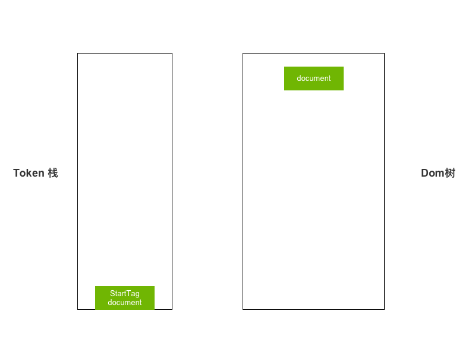
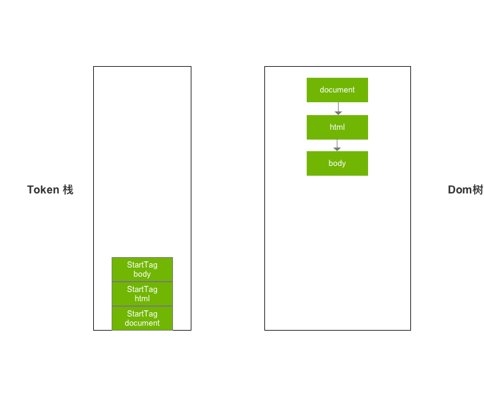
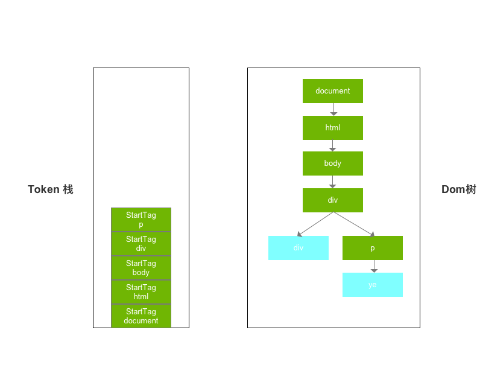
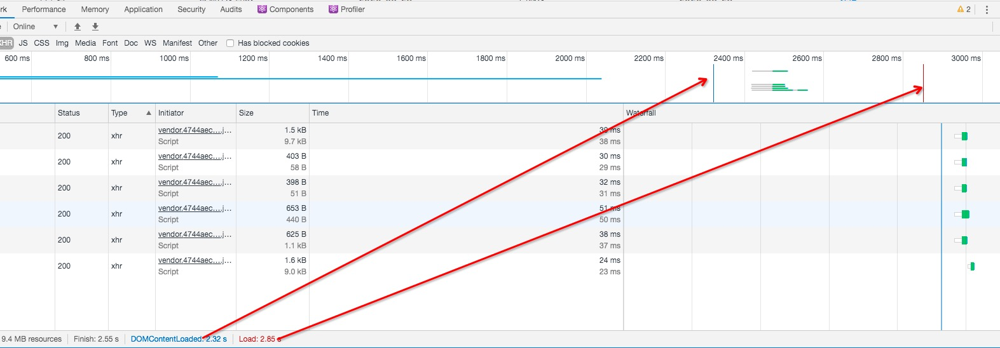
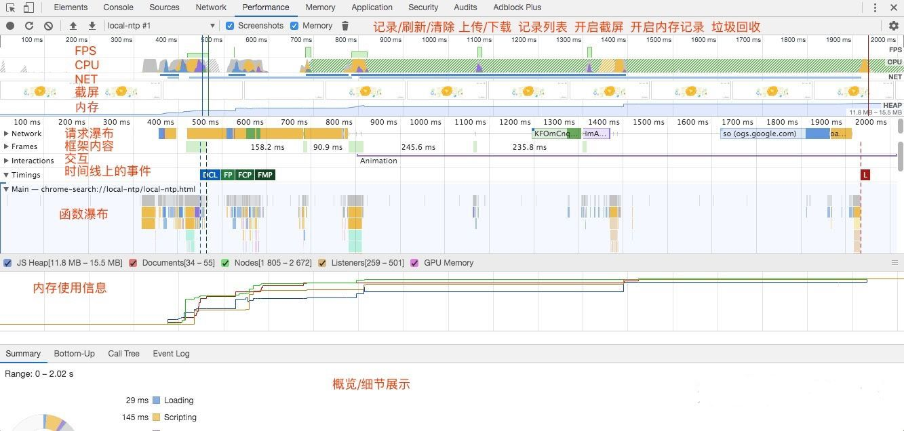

# 浏览器系列

## 浏览器内核
| 浏览器/RunTime | 内核（渲染引擎） | JavaScript 引擎 |
| :-:| :-: | :-: |
| Chrome | Blink（28~）Webkit（Chrome 27） | V8 |
| FireFox | Gecko | SpiderMonkey |
| Safari | Webkit | JavaScriptCore |
| Edge | EdgeHTML | Chakra(for JavaScript) |
| IE | Trident | Chakra(for JScript) |
| Node.js | - | Node.js |

## 浏览器架构

本文介绍的浏览器架构是基于Chrome浏览器的。

在这之前先理解什么是进程和线程

### 进程和线程

**线程**

线程：CPU调度的最小单位

线程有单线程、多线程之分。多线程可以并行处理提高性能。

线程不能单独存在的，它是由进程来启动和管理。

**进程**

进程：CPU进行资源分配的基本单位

一个进程就是一个程序的运行实例。

详细解释就是，启动一个程序的时候，操作系统会为该程序创建一块内存，用来存放代码、运行中的数据和一个执行任务的主线程，我们把这样的一个运行环境叫进程。

**总结**

比喻加深理解 进程=火车，线程=车厢

* 线程在进程下运行（车厢组成火车，单独车厢无法运行）
* 一个进程可以包含多进程（一辆火车有多节车厢）
* 不同进程之间数据很难共享（一辆火车换乘到另一辆是比较麻烦的）
* 同一进程下不同线程数据易共享（车厢之间更换还是简便的）
* 进程要比线程消耗更多的计算机资源（采用多列火车比采用多节车厢耗费资源）
* 进程间互相不影响，一个线程挂掉将导致整个进程挂掉（火车与火车间互不性影响，但比如一节车厢着火会影响整辆火车）
* 进程可以拓展到多机，进程最多适合多核 （不同火车可以开在多个轨道上，同一火车的车厢不能在行进的不同的轨道上）
* 进程使用的内存地址可以上锁，即一个线程使用某些共享内存时，其他线程必须等它结束，才能使用这一块内存。（比如火车上的洗手间）－"互斥锁"
* 进程使用的内存地址可以限定使用量（比如火车上的餐厅，最多只允许多少人进入，如果满了需要在门口等，等有人出来了才能进去）－“信号量”

### 浏览器的多进程架构

浏览器的发展也是从最开始的单进程发展到目前的多进程架构

#### 浏览器单进程时代

顾名思义，单进程浏览器是指浏览器的所有功能模块都是运行在同一个进程里，这些模块包含了网络、插件、JavaScript 运行环境、渲染引擎和页面等。其实早在 2007 年之前，市面上浏览器都是单进程的。

如此多的功能模块运行在一个进程里，是导致单进程浏览器不稳定、不流畅和不安全的一个主要因素。下面我就来一一分析下出现这些问题的原因。

1. 不稳定

早期浏览器需要借助于插件来实现诸如 Web 视频、Web 游戏等各种强大的功能，但是插件是最容易出问题的模块，并且还运行在浏览器进程之中，所以一个插件的意外崩溃会引起整个浏览器的崩溃。除了插件之外，渲染引擎模块也是不稳定的，通常一些复杂的 JavaScript 代码就有可能引起渲染引擎模块的崩溃。和插件一样，渲染引擎的崩溃也会导致整个浏览器的崩溃

2. 不流畅

页面的渲染模块、JavaScript 执行环境以及插件都是运行在同一个线程中的，这就意味着同一时刻只能有一个模块可以执行。

如果有一个脚本是无限循环的，所以当其执行时，它会独占整个线程，这样导致其他运行在该线程中的模块就没有机会被执行

3. 不安全

插件可以使用 C/C++ 等代码编写，通过插件可以获取到操作系统的任意资源，当你在页面运行一个插件时也就意味着这个插件能完全操作你的电脑。如果是个恶意插件，那么它就可以释放病毒、窃取你的账号密码，引发安全性问题。

至于页面脚本，它可以通过浏览器的漏洞来获取系统权限，这些脚本获取系统权限之后也可以对你的电脑做一些恶意的事情，同样也会引发安全问题。

目前的Chrome进程架构，如下图所示


从图中可以看出，最新的Chrome 浏览器包括：1个浏览器主进程、1个GPU进程、1个网络进程、多个渲染进程和多个插件进程。

* **浏览器进程** 主要负责界面显示、用户交互、子进程管理、同时提供存储等功能。
* **渲染进程** 核心任务是将HTML、CSS和JavaScript 转换为用户可以与之交互的网页，排版引擎 Blink 和 JavaScript 引擎 V8 都是运行在该进程中，默认情况下，Chrome 会为每个 Tab 标签创建一个渲染进程。出于安全考虑，渲染进程都是运行在沙箱模式下。
* **GPU进程** 其实，Chrome 刚开始发布的时候是没有 GPU 进程的。而 GPU 的使用初衷是为了实现 3D CSS 的效果，只是随后网页、Chrome 的 UI 界面都选择采用 GPU 来绘制，这使得 GPU 成为浏览器普遍的需求。最后，Chrome 在其多进程架构上也引入了 GPU 进程。
* **网络进程** 主要负责页面的网络资源加载，之前是作为一个模块运行在浏览器进程里面的，直至最近才独立出来，成为一个单独的进程。
* **插件进程** 主要是负责插件的运行，因插件易崩溃，所以需要通过插件进程来隔离，以保证插件进程崩溃不会对浏览器和页面造成影响。

这个就是为什么打开一个页面，需要有4个进程。因为打开 1 个页面至少需要 1 个网络进程、1 个浏览器进程、1 个 GPU 进程以及 1 个渲染进程，共 4 个；如果打开的页面有运行插件的话，还需要再加上 1 个插件进程。

你可以点击 Chrome 浏览器右上角的“选项”菜单，选择“更多工具”子菜单，点击“任务管理器”，就可以查看到进程信息。


## 浏览器渲染机制

由于渲染机制过于复杂，所以渲染模块在执行过程中会被划分为很多子阶段，输入的 HTML 经过这些子阶段，最后输出像素。我们把这样的一个处理流程叫做渲染流水线，其大致流程如下图所示：


按照渲染的时间顺序，流水线可分为如下几个子阶段：构建 DOM 树、样式计算、布局阶段、分层、绘制、分块、光栅化和合成。

在介绍每个阶段的过程中，你应该重点关注以下三点内容：

1. 开始每个子阶段都有其输入的内容
2. 然后每个子阶段有其处理过程；
3. 最终每个子阶段会生成输出内容。

### 构建DOM树

因为浏览器无法直接理解和使用 HTML，所以需要将 HTML 转换为浏览器能够理解的结构——DOM 树。


构建 DOM 树的输入内容是一个非常简单的 HTML 文件，然后经由 HTML 解析器解析，最终输出树状结构的 DOM。

为了更加直观地理解 DOM 树，你可以打开 Chrome 的“开发者工具”，选择“Console”标签来打开控制台，然后在控制台里面输入“document”后回车，这样你就能看到一个完整的 DOM 树结构

DOM 和 HTML 内容几乎是一样的，但是和 HTML 不同的是，DOM 是保存在内存中树状结构，可以通过 JavaScript 来查询或修改其内容。

#### HTML解析器

从后端返回给浏览器渲染引擎 HTML 文件字节流，HTML 文件字节流返回的过程中 HTML 解析器就一直在解析，边加载边解析。

##### 阶段一 字节流转换为字符并W3C标准令牌化

读取HTML的原始字节流，并根据文件的指定编码（例如UTF-8）将它们转换成各个字符。并将字符串转换成W3C HTML5标准规定的各种令牌。每个令牌都具有特殊含义和一组规则。

一堆字节流 bytes

` 3C 2B 1A `

转换成正常的html文件

```html
<html>
<body>
  <div>hi <p>ye</p> </div>
</body>
</html>
```

##### 阶段二 通过分词器将字节流转化为 Token

分词器将字节流转换为一个一个的Token，Token分为Tag Token和文本Token，上面这段代码最后分词转化的结果是：


##### 阶段三 Token解析为DOM节点

HTML解析器维护了一个Token栈结构，这个栈结构的目的就是用来计算节点间的父子关系。具体规则如下：

* HTML解析器开始工作时，会默认创建一个根为document的空DOM结构，同时会将一个StartTag document的Token压入栈底。



* 如果压入栈中的是startTagToken类型，HTML解析器会为该Token创建一个DOM节点，然后将该节点加入到DOM树种，它的父节点为栈中相邻元素生成的DOM节点。



* 如果是文本Token，那么会直接生成一个文件节点，加入到DOM树种，不需要入栈。它的父节点就是当前栈顶对应的DOM节点



* 如果解析到了endTag标签，则会比较栈顶是否为对应的tag标签。如果是则对应的startTag会出栈，表示该元素解析完成。

* 然后如上的规则，分词器一路解析，就形成了简单的DOM树。


### 样式计算（Recalculate Style）

样式计算的目的是为了计算出 DOM 节点中每个元素的具体样式，这个阶段大体可分为三步来完成。

1. 把 CSS 转换为浏览器能够理解的结构

CSS 样式来源主要有三种：

* 通过 link 引用的外部 CSS 文件
* `<style>`标记内的 CSS
* 元素的 style 属性内嵌的 CSS

和 HTML 文件一样，浏览器也是无法直接理解这些纯文本的 CSS 样式，所以**当渲染引擎接收到 CSS 文本时，会执行一个转换操作，将 CSS 文本转换为浏览器可以理解的结构——styleSheets**。

在控制台中输入 document.styleSheets可以查看。

2. 转换样式表中的属性值，使其标准化

现在我们已经把现有的 CSS 文本转化为浏览器可以理解的结构了，那么接下来就要对其进行属性值的标准化操作。

什么是标准化呢，就是将所有值转换为渲染引擎容易理解的、标准化的计算值。

3. 计算出 DOM 树中每个节点的具体样式

这步涉及到 CSS 的继承规则和层叠规则。

CSS 继承就是每个 DOM 节点都包含有父节点的样式

层叠是 CSS 的一个基本特征，它是一个定义了如何合并来自多个源的属性值的算法。它在 CSS 处于核心地位，CSS 的全称“层叠样式表”正是强调了这一点

这个阶段最终输出的内容是每个 DOM 节点的样式，并被保存在 ComputedStyle 的结构内。

如果你想了解每个 DOM 元素最终的计算样式，可以打开 Chrome 的“开发者工具”，选择第一个“element”标签，然后再选择“Computed”子标签，如下图所示：


### 布局阶段

Chrome 在布局阶段需要完成两个任务：创建布局树和布局计算。

**1. 创建布局树**

你可能注意到了 DOM 树还含有很多不可见的元素，比如 head 标签，还有使用了 display:none 属性的元素。所以在显示之前，我们还要额外地构建一棵只包含可见元素布局树。

我们结合下图来看看布局树的构造过程:


从上图可以看出，DOM 树中所有不可见的节点都没有包含到布局树中。

为了构建布局树，浏览器大体上完成了下面这些工作：

* 遍历 DOM 树中的所有可见节点，并把这些节点加到布局树中；
* 而不可见的节点会被布局树忽略掉，如 head 标签下面的全部内容，再比如 body.p.span 这个元素，因为它的属性包含 dispaly:none，所以这个元素也没有被包进布局树。

**2. 布局计算**

### 分层

因为页面中有很多复杂的效果，如一些复杂的 3D 变换、页面滚动，或者使用 z-indexing 做 z 轴排序等，为了更加方便地实现这些效果，渲染引擎还需要为特定的节点生成专用的图层，并生成一棵对应的图层树（LayerTree）

要想直观地理解什么是图层，你可以打开 Chrome 的“开发者工具”，选择右上角三个点 选中的more tools 选择“Layers”标签，就可以可视化页面的分层情况

会发现浏览器的页面实际上被分成了很多图层，这些图层叠加后合成了最终的页面。

下面来看看这些图层和布局树节点之间的关系，如文中图所示：


并不是布局树的每个节点都包含一个图层，如果一个节点没有对应的层，那么这个节点就从属于父节点的图层

那么需要满足什么条件，渲染引擎才会为特定的节点创建新的图层呢？通常满足下面两点中任意一点的元素就可以被提升为单独的一个图层。

1. 拥有层叠上下文属性的元素会被提升为单独的一层

页面是个二维平面，但是层叠上下文能够让 HTML 元素具有三维概念，这些 HTML 元素按照自身属性的优先级分布在垂直于这个二维平面的 z 轴上

若你想要了解更多层叠上下文的知识，你可以[参考这篇文章](https://developer.mozilla.org/zh-CN/docs/Web/Guide/CSS/Understanding_z_index/The_stacking_context)。

2. 需要剪裁（clip）的地方也会被创建为图层。

那什么是裁剪呢

比如我们把一个 div 的大小限定为 200 * 200 像素，而 div 里面的文字内容比较多，文字所显示的区域肯定会超出 200 * 200 的面积，这时候就产生了剪裁

出现这种裁剪情况的时候，渲染引擎会为文字部分单独创建一个层，如果出现滚动条，滚动条也会被提升为单独的层


所以说，元素有了层叠上下文的属性或者需要被剪裁，满足其中任意一点，就会被提升成为单独一层。

### 图层绘制

在完成图层树的构建之后，渲染引擎会对图层树中的每个图层进行绘制

渲染引擎实现图层的绘制，会把一个图层的绘制拆分成很多小的绘制指令，然后再把这些指令按照顺序组成一个待绘制列表

你可以打开“开发者工具”的“Layers”标签，选择“document”层，来实际体验下绘制列表，如下图所示：

在该图中，区域 1 就是 document 的绘制列表，拖动区域 2 中的进度条可以重现列表的绘制过程。

### 栅格化（raster）操作

绘制列表只是用来记录绘制顺序和绘制指令的列表，而实际上绘制操作是由渲染引擎中的合成线程来完成的

在有些情况下，有的图层可以很大，比如有的页面你使用滚动条要滚动好久才能滚动到底部，但是通过视口，用户只能看到页面的很小一部分，所以在这种情况下，要绘制出所有图层内容的话，就会产生太大的开销，而且也没有必要。

基于这个原因，合成线程会将图层划分为图块（tile），这些图块的大小通常是 256x256 或者 512x512。如下图所示：


然后合成线程会按照视口附近的图块来优先生成位图，实际生成位图的操作是由栅格化来执行的。所谓栅格化，是指将图块转换为位图.

而图块是栅格化执行的最小单位。渲染进程维护了一个栅格化的线程池，所有的图块栅格化都是在线程池内执行的.通常，栅格化过程都会使用 GPU 来加速生成，使用 GPU 生成位图的过程叫快速栅格化，或者 GPU 栅格化，生成的位图被保存在 GPU 内存中。


### 合成与显示

一旦所有图块都被光栅化，合成线程就会生成一个绘制图块的命令——“DrawQuad”，然后将该命令提交给浏览器进程。

浏览器进程里面有一个叫 viz 的组件，用来接收合成线程发过来的 DrawQuad 命令，然后根据 DrawQuad 命令，将其页面内容绘制到内存中，最后再将内存显示在屏幕上。

到这里，经过这一系列的阶段，编写好的 HTML、CSS、JavaScript 等文件，经过浏览器就会显示出漂亮的页面了。

### 渲染流水线总结

用一张图来总结下这整个渲染流程：


1. 渲染进程将HTML内容转换为浏览器能够读懂的**DOM树**结构
2. 渲染引擎将CSS样式表转化为浏览器可以理解的**styleSheets**,计算出DOM节点的样式
3. 创建**布局树**,并计算元素的布局信息
4. 对布局树进行分层，并生成**分层树**
5. 为每个图层生成**绘制列表**，并将其提交到合成线程
6. 合成线程将图层分成**图块**，并在**光栅化线程池**中将图块转换成位图
7. 合成线程发送绘制图块命令**DrawQuad**给浏览器进程
8. 浏览器进程根据DrawQuad消息**生成页面**，并**显示**到显示器上

###  重排、重绘、合成

1. 更新了元素的几何属性（重排）

你可先参考下图:


从上图可以看出，如果你通过 JavaScript 或者 CSS 修改元素的几何位置属性，例如改变元素的宽度、高度等，那么浏览器会触发重新布局，解析之后的一系列子阶段，这个过程就叫**重排**。无疑，**重排需要更新完整的渲染流水线，所以开销也是最大的**。

2. 更新元素的绘制属性（重绘）

比如通过 JavaScript 更改某些元素的背景颜色，渲染流水线会调整为如下图：


从图中可以看出，如果修改了元素的背景颜色，那么布局阶段将不会被执行，因为并没有引起几何位置的变换，所以就直接进入了绘制阶段，然后执行之后的一系列子阶段，这个过程就叫**重绘**。相较于重排操作，**重绘省去了布局和分层阶段，所以执行效率会比重排操作要高一些**。

3. 直接合成阶段

那如果你更改一个既不要布局也不要绘制的属性，那么渲染引擎将跳过布局和绘制，只执行后续的合成操作，我们把这个过程叫做合成。具体流程参考下图：


在上图中，我们使用了 CSS 的 transform 来实现动画效果，这可以避开重排和重绘阶段，直接在非主线程上执行合成动画操作。这样的效率是最高的，因为是在非主线程上合成，并没有占用主线程的资源，另外也避开了布局和绘制两个子阶段，**所以相对于重绘和重排，合成能大大提升绘制效率**。


#### 减少重排与重绘
* 使用 class 操作样式，而不是频繁操作 style
* 避免使用 table 布局
* Debounce window resize 事件
* 对 dom 属性的读写要分离
* will-change: transform 做优化
* 批量dom 操作，例如 createDocumentFragment，或者使用框架，例如 React

我们可以通过createDocumentFragment创建一个游离于DOM树之外的节点，然后在此节点上批量操作，最后插入DOM树中，因此只触发一次重排
```javascript
var fragment = document.createDocumentFragment();

for (let i = 0;i<10;i++){
  let node = document.createElement("p");
  node.innerHTML = i;
  fragment.appendChild(node);
}

document.body.appendChild(fragment);
```

设备刷新率是设备屏幕渲染的频率60HZ 也就是屏幕在1s内渲染60次，约16.7ms渲染一次屏幕。这就意味着，我们的浏览器最佳的渲染性能就是所有的操作在一帧16.7ms内完成。

### Load 和 DOMContentLoaded 区别
Load 事件触发代表页面中的 DOM，CSS，JS，图片已经全部加载完毕。

DOMContentLoaded 事件触发代表初始的 HTML 被完全加载和解析，不需要等待 CSS，JS，图片加载\

### JS对DOM、CSSOM构建的影响

分为三种情况。

1. 页面中只有HTML和JS，且JS不是外部引入

DOM 树构建时当遇到JavaScript脚本，就要暂停 DOM 解析，先去执行Javascript，因为在JavaScript可能会操作当前已经生成的DOM节点。

有一点需要注意:javascript是可能操作当前已经生成的DOM节点，如果是后面还未生成的DOM节点是不生效的

2. 当页面中同时有Html、JavaScript、CSS ，而且都非外部引入。

DOM 树构建时当遇到 JavaScript 脚本，就要暂停 DOM 解析，先去执行 JavaScript，同时 JavaScript 还要判断 CSSOM 是否解析完成，因为在 JavaScript 可能会操作 CSSOM 节点，CSSOM 节点确认解析完成，执行 JavaScript 再次回到 DOM 树创建。（所以这里也可以理解为CSS解析间接影响DOM树创建）

3. 当页面中同时有Html，JavaScript， CSS ，而且外部引入

Webkit渲染引擎有一个优化，当渲染进程接收HTML文件字节流时，会先开启一个预解析线程，如果遇到 JavaScript 文件或者 CSS 文件，那么预解析线程会提前下载这些数据。DOM树在创建过程中如果遇到JavaScript文件，接下来就和情况2类型一样了。


## 垃圾回收机制

在了解垃圾回收机制之前先了解数据是如何存储的。

### 数据的存储

在JavaScript 的执行过程中，主要有三种类型内存空间：**代码空间**、**栈空间**、**堆空间**

其中的代码空间主要是存储可执行代码；栈空间就是我们之前反复提及的调用栈，是用来存储执行上下文的；对象类型是存放在堆空间的，在栈空间中只是保留了对象的引用地址。

### 垃圾数据如何回收

什么是垃圾数据呢。有些数据被使用之后，可能就不在需要了，这种数据称为垃圾数据。如果这些垃圾数据一直保存在内存中，那么内存会越用越多，所以我们需要对这些垃圾数据进行回收，以释放有限的内存空间。

通常情况下，垃圾数据回收分为手动回收和自动回收两种策略。JS中是自动回收策略

#### 调用栈中的垃圾数据回收

在调用栈中有一个记录当前执行状态的指针（称为ESP），指向调用栈中当前正在执行的上下文。当当前函数被执行完成，JS会将ESP下移到下一个函数执行上下文。这个下移操作就是销毁一个执行上下文的过程。因为之前的执行上下文虽然还是保存在栈内存中，但是已经是无效内存，会被之后的内容所覆盖。

所以说，当一个函数执行结束之后，JavaScript 引擎会通过向下移动 ESP 来销毁该函数保存在栈中的执行上下文。

#### 堆中的垃圾数据回收

要回收堆中的垃圾数据，就需要用到 JavaScript 中的垃圾回收器了。

在此之前需要了解一个`代际假说(The Generational Hypothesis)`的概念。

**代际假说**有以下两个特点：
  * 第一个是大部分对象在内存中存在的时间很短，简单来说，就是很多对象一经分配内存，很快就变得不可访问。
  * 第二个是不死的对象，会活得更久

通常，垃圾回收算法有很多种，但是并没有哪一种能胜任所有的场景，你需要权衡各种场景，根据对象的生存周期的不同而使用不同的算法，以便达到最好的效果。所以，在 V8 中会把堆分为**新生代**和**老生代**两个区域，**新生代中存放的是生存时间短的对象，老生代中存放的生存时间久的对象**。 

新生区通常只支持 1～8M 的容量，而老生区支持的容量就大很多了。对于这两块区域，V8 分别使用两个不同的垃圾回收器，以便更高效地实施垃圾回收。

  * 副垃圾回收器，主要负责新生代的垃圾回收。
  * 主垃圾回收器，主要负责老生代的垃圾回收。

### 垃圾回收器的工作流程

不论什么类型的垃圾回收器，它们都有一套共同的执行流程。
  * 标记空间中活动对象和非活动对象。所谓活动对象就是还在使用的对象，非活动对象就是可以进行垃圾回收的对象。
  * 回收非活动对象所占据的内存。其实就是在所有的标记完成之后，统一清理内存中所有被标记为可回收的对象。
  * 内存整理 频繁回收对象后，内存中就会存在大量不连续空间，如果需要分配较大连续内存的时候，就有可能出现内存不足的情况。所以最后一步需要整理这些内存碎片

#### 副垃圾回收器

副垃圾回收器，主要负责新生代的垃圾回收。新生代中用 **Scavenge 算法**来处理。所谓 Scavenge 算法，是把新生代空间对半划分为两个区域，一半是对象区域，一半是空闲区域，如下图所示：


新加入的对象都会存放到对象区域，当对象区域快被写满时，就需要执行一次垃圾清理操作。

垃圾对象的回收操作
1. 首先要对对象区域中的垃圾做标记；
2. 标记完成之后，就进入垃圾清理阶段，
3. 副垃圾回收器会把这些存活的对象复制到空闲区域中，同时它还会把这些对象有序地排列起来，
4. 完成复制后，对象区域与空闲区域进行角色翻转,也就是原来的对象区域变成空闲区域，原来的空闲区域变成了对象区域

新生区的空间会被设置得比较小,是因为由于新生代中采用的 Scavenge 算法，所以每次执行清理操作时，都需要将存活的对象从对象区域复制到空闲区域。但复制操作需要时间成本。空间大的话 时间就会过很久。

也正是因为新生区的空间不大，所以很容易被存活的对象装满整个区域。为了解决这个问题，JavaScript 引擎采用了对象**晋升策略**，也就是经过两次垃圾回收依然还存活的对象，会被移动到老生区中。

#### 主垃圾回收器

主垃圾回收器主要负责老生区中的垃圾回收。除了新生区中晋升的对象，一些大的对象会直接被分配到老生区。因此老生区中的对象有两个特点，一个是对象占用空间大，另一个是对象存活时间长。

主垃圾回收器是采用**标记-清除Mark-Sweep**的算法进行垃圾回收的

工作流程：
1. 首先是标记过程阶段。标记阶段就是从一组根元素开始，递归遍历这组根元素，在这个遍历过程中，能到达的元素称为活动对象，没有到达的元素就可以判断为垃圾数据。
2. 接下来就是垃圾的清除过程。它和副垃圾回收器的垃圾清除过程完全不同，你可以理解这个过程是清除掉红色标记数据的过程，可参考下图大致理解下其清除过程：


上面的标记过程和清除过程就是标记 - 清除算法，不过对一块内存多次执行标记 - 清除算法后，会产生大量不连续的内存碎片。而碎片过多会导致大对象无法分配到足够的连续内存，于是又产生了另外一种算法——**标记-整理 Mark-Compact**这个标记过程仍然与标记 - 清除算法里的是一样的，但后续步骤不是直接对可回收对象进行清理，而是让所有存活的对象都向一端移动，然后直接清理掉端边界以外的内存。你可以参考下图：


### 全停顿

现在你知道了 V8 是使用副垃圾回收器和主垃圾回收器处理垃圾回收的，不过由于 JavaScript 是运行在主线程之上的，一旦执行垃圾回收算法，都需要将正在执行的 JavaScript 脚本暂停下来，待垃圾回收完毕后再恢复脚本执行。我们把这种行为叫做**全停顿（Stop-The-World）**。

比如堆中的数据有 1.5GB，V8 实现一次完整的垃圾回收需要 1 秒以上的时间，这也是由于垃圾回收而引起 JavaScript 线程暂停执行的时间，若是这样的时间花销，那么应用的性能和响应能力都会直线下降。主垃圾回收器执行一次完整的垃圾回收流程如下图所示：


在 V8 新生代的垃圾回收中，因其空间较小，且存活对象较少，所以全停顿的影响不大，但老生代就不一样了。如果在执行垃圾回收的过程中，占用主线程时间过久，就像上面图片展示的那样，花费了 200 毫秒，在这 200 毫秒内，主线程是不能做其他事情的。比如页面正在执行一个 JavaScript 动画，因为垃圾回收器在工作，就会导致这个动画在这 200 毫秒内无法执行的，这将会造成页面的卡顿现象。

为了降低老生代的垃圾回收而造成的卡顿，V8 将标记过程分为一个个的子标记过程，同时让垃圾回收标记和 JavaScript 应用逻辑交替进行，直到标记阶段完成，我们把这个算法称为增量标记（Incremental Marking）算法。如下图所示：


使用增量标记算法，可以把一个完整的垃圾回收任务拆分为很多小的任务，这些小的任务执行时间比较短，可以穿插在其他的 JavaScript 任务中间执行，这样当执行上述动画效果时，就不会让用户因为垃圾回收任务而感受到页面的卡顿了。

## 跨域

### 跨域的产生

因为浏览器有一种安全机制叫做同源策略。

同源策略是一种约定，它是浏览器最核心也最基本的安全功能，如果缺少了同源策略，浏览器很容易受到XSS、CSRF等攻击。所谓同源是指"协议+域名+端口"三者相同，即便两个不同的域名指向同一个ip地址，也非同源。


同源策略限制内容有：
* Cookie、LocalStorage、IndexedDB 等存储性内容
* DOM 节点
* AJAX 请求发送后，结果被浏览器拦截了

以下三个标签可以不受限制：

* ``
* `<link href=XXX>`
* `<script src=XXX>`

### 跨域的解决

#### JSONP

JSONP 是 JSON with padding的简写. JSONP本质上是一个Hack，它利用`<script>`标签不受同源策略限制的特性进行跨域操作。由两部分组成:回调函数和数据。回调函数是当响应到来时应该在页面中调用的函数。回调 函数的名字一般是在请求中指定的。而数据是被放入到回调函数的参数中。下面是一个典型的 JSONP 请求。

```javascript
<script src="http://domain/api?callback=jsonp"></script>
```
优点：
1. 实现简单
2. 兼容性非常好

缺点：

1. 只支持get请求（因为`<script>`标签只能get）
2. 有安全性问题，可能会遭受XSS攻击
3. 需要服务端配合jsonp进行一定程度的改造

#### CORS

跨域资源共享(CORS) 是一种机制，它使用额外的 HTTP 头来告诉浏览器  让运行在一个 origin (domain) 上的Web应用被准许访问来自不同源服务器上的指定的资源。

CORS 需要浏览器和后端同时支持。服务端设置 Access-Control-Allow-Origin 就可以开启 CORS。

cors 中会有 `简单请求` 和 `复杂请求` 的概念

1. 简单请求

不会触发 CORS 预检请求。这样的请求为“简单请求”，请注意，该术语并不属于 Fetch （其中定义了 CORS）规范。若请求满足所有下述条件，则该请求可视为“简单请求”：

情况一: 使用以下方法(意思就是以下请求意外的都是非简单请求)

* GET
* HEAD
* POST

情况二: 人为设置以下集合外的请求头

* Accept
* Accept-Language
* Content-Language
* Content-Type （需要注意额外的限制）
* DPR
* Downlink
* Save-Data
* Viewport-Width
* Width

情况三：Content-Type的值仅限于下列三者之一：(例如 application/json 为非简单请求)

* text/plain
* multipart/form-data
* application/x-www-form-urlencoded

情况四:

请求中的任意XMLHttpRequestUpload 对象均没有注册任何事件监听器；XMLHttpRequestUpload 对象可以使用 XMLHttpRequest.upload 属性访问。

情况五:

请求中没有使用 ReadableStream 对象。

2. 非简单请求

除以上情况外的。


Node中CORS解决代码原生写法
```javascript
app.use(async (ctx, next) => {
  ctx.set("Access-Control-Allow-Origin", ctx.headers.origin);
  ctx.set("Access-Control-Allow-Credentials", true);
  ctx.set("Access-Control-Request-Method", "PUT,POST,GET,DELETE,OPTIONS");
  ctx.set(
    "Access-Control-Allow-Headers",
    "Origin, X-Requested-With, Content-Type, Accept, cc"
  );
  if (ctx.method === "OPTIONS") {
    ctx.status = 204;
    return;
  }
  await next();
});

```
为了方便可以直接使用中间件`koa-cors`
#### Nginx

使用nginx反向代理实现跨域，是最简单的跨域方式。只需要修改nginx的配置即可解决跨域问题，支持所有浏览器，支持session，不需要修改任何代码，并且不会影响服务器性能。

#### postMessage

postMessage()方法允许来自不同源的脚本采用异步方式进行有限的通信，可以实现跨文本档、多窗口、跨域消息传递。

<!-- https://github.com/funnycoderstar/blog/issues/73 -->
<!-- https://mp.weixin.qq.com/s/AHsrlQsEJu3LrT-1RGdFDQ -->


## 本地存储

### cookies

cookie 是指存储在用户本地终端上的数据，同时它是与具体的web页面或者站点相关。cookie数据会自动在web浏览器和web服务器之间传输。

#### 特性

* 不同的浏览器存放的cookie位置不一样
* cookie的存储是以域名形式区分的，不同的域下存储的cookie是独立
* 可以设置cookie生效的域，也就是说我们能操作的cookie是当前域以及当前域下的子域
* 一个域名下存储的cookie个数是有限的
* 每个cookie存放的内容大小也是有限制的，不同的浏览器存放大小不一样，一般为4KB。
* cookie也可以设置过期的时间，默认是会话结束的时候，当时间到期自动销毁


#### cookie的增删改

**设置**

cookie的设置可以分为服务端设置和客户端设置

1. **服务端设置**

服务器端响应的response header 中 set-cookie,是服务端专门用来设置cookie的。

语法：`Set-Cookie: value[; expires=date][; domain=domain][; path=path][; secure]`

注意： 
  * 一个set-Cookie字段只能设置一个cookie，当你要想设置多个 cookie，需要添加同样多的set-Cookie字段。
  * 服务端可以设置cookie 的所有选项：expires、domain、path、secure、HttpOnly 
  * 通过 Set-Cookie 指定的这些可选项只会在浏览器端使用，而不会被发送至服务器端。

2. **客户端设置**

语法：`document.cookie = "key=value[;expires=date][;domain=domain][;path=path][;secure]" `

注意：客户端可以设置cookie 的下列选项：expires、domain、path、secure（有条件：只有在https协议的网页中，客户端设置secure类型的 cookie 才能成功），但无法设置HttpOnly选项。

**读取**

通过document.cookie来获取当前网站下的cookie的时候，得到的字符串形式的值，它包含了当前网站下所有的cookie（为避免跨域脚本(xss)攻击，这个方法只能获取非 HttpOnly 类型的cookie）。它会把所有的cookie通过一个分号+空格的形式串联起来 例如username=xx; age=xxx

**修改**

要想修改一个cookie，只需要重新赋值就行，旧的值会被新的值覆盖。但要注意一点，在设置新cookie时，path/domain这几个选项一定要旧cookie 保持一样。否则不会修改旧值，而是添加了一个新的 cookie。

**删除**

把要删除的cookie的过期时间设置成已过去的时间,path/domain/这几个选项一定要旧cookie 保持一样。

#### 属性

1. expires

用来设置cookie的有效时间，默认为浏览器会话(Session)。

时间必须是 GMT 格式的时间；可以通过 new Date().toGMTString()或者new Date().toUTCString() 来获得 。

例如`expires=Thu, 25 Feb 2020 14:18:00 GMT`表示cookie讲在2020年2月25日14:18分之后失效，对于失效的cookie浏览器会清空。

注意:

expires 是 http/1.0协议中的选项，在新的http/1.1协议中expires已经由 max-age 选项代替，两者的作用都是限制cookie 的有效时间。

expires的值是一个时间点（cookie失效时刻= expires），而max-age 的值是一个以秒为单位时间段（cookie失效时刻= 创建时刻+ max-age）。

max-age 的默认值是 -1(即有效期为 session )；若max-age有三种可能值：负数、0、正数。负数：有效期session；0：删除cookie；正数：有效期为创建时刻+ max-age

假如 Expires 和 Max-Age 都存在，Max-Age 优先级更高。

2. Domain

Domain 指定了 Cookie 可以送达的主机名。假如没有指定，那么默认值为当前文档访问地址中的主机部分（但是不包含子域名）。

但是很多网址不止有一个域名比如：a.example.com和b.example.com如果他们想要共享cookie那么cookie的domain需要设置为domain=.example.com

注意的是不能跨域设置 Cookie

3. Path

Path 指定了一个 URL 路径，这个路径必须出现在要请求的资源的路径中才可以发送 Cookie 首部。比如设置 Path=/docs，/docs/Web/ 下的资源会带 Cookie 首部，/test 则不会携带 Cookie 首部。

Domain 和 Path 标识共同定义了 Cookie 的作用域：即 Cookie 应该发送给哪些 URL。

4. Secure

标记为 Secure 的 Cookie 只应通过被HTTPS协议加密过的请求发送给服务端。使用 HTTPS 安全协议，可以保护 Cookie 在浏览器和 Web 服务器间的传输过程中不被窃取和篡改。

5. HTTPOnly

设置 HTTPOnly 属性可以防止客户端脚本通过 document.cookie 等方式访问 Cookie，有助于避免 XSS 攻击。

6. SameSite

SameSite 是最近非常值得一提的内容，因为 2020年 2 月份发布的 Chrome80 版本中默认屏蔽了第三方的 Cookie。

SameSite 属性可以让 Cookie 在跨站请求时不会被发送，从而可以阻止跨站请求伪造攻击（CSRF）。

SameSite 可以有下面三种值：
1. **Strict** 仅允许一方请求携带Cookie，即浏览器将只发送相同站点请求的Cookie，即当前网页URL与请求目标URL完全一致
2. **Lax** 允许部分第三方请求携带Cookie
3. **None** 无论是否跨站都会发送Cookie

之前默认是None，Chrome80版本后默认是Lax

什么是跨站

Cookie中的「同站」判断就比较宽松：只要两个 URL 的 eTLD+1 相同即可，不需要考虑协议和端口。

其中，eTLD 表示有效顶级域名，注册于 Mozilla 维护的公共后缀列表（Public Suffix List）中，例如，.com、.co.uk、.github.io 等。eTLD+1 则表示，有效顶级域名+二级域名，例如 taobao.com 等。

举几个例子，www.taobao.com 和 www.baidu.com 是跨站，www.a.taobao.com 和 www.b.taobao.com 是同站，a.github.io 和 b.github.io 是跨站(注意是跨站)。

SameSite 的值从None 变为 Lax 所带来的影响有哪些

|请求类型|实例|Strict|Lax|None|
|:-:|:-:|:-:|:-:|:-:|
|链接|`<a href="..."></a>`|不发送|发送cookie|发送cookie|
|get表单|`<form method="GET" action="">`|不发送|发送cookie|发送cookie|
|post表单|`<form method="POST" action="">`|不发送|不发送|发送cookie|
|iframe|`<iframe src=".."></iframe>`|不发送|不发送|发送cookie|
|AJAX|`$.get()`|不发送|不发送|发送cookie|
|Image|``|不发送|不发送|发送cookie|

从表格中可以看出，对大部分 web 应用而言，Post 表单，iframe，AJAX，Image 这四种情况从以前的跨站会发送三方 Cookie，变成了不发送。

Post表单：应该的，学 CSRF 总会举表单的例子。

iframe：iframe 嵌入的 web 应用有很多是跨站的，都会受到影响。

AJAX：可能会影响部分前端取值的行为和结果。

Image：图片一般放 CDN，大部分情况不需要 Cookie，故影响有限。但如果引用了需要鉴权的图片，可能会受到影响


不过也会有两点要注意的地方：

1. HTTP 接口不支持 SameSite=none

如果你想加 SameSite=none 属性，那么该 Cookie 就必须同时加上 Secure 属性，表示只有在 HTTPS 协议下该 Cookie 才会被发送。

2. 需要 UA 检测，部分浏览器不能加 SameSite=none
IOS 12 的 Safari 以及老版本的一些 Chrome 会把 SameSite=none 识别成 SameSite=Strict，所以服务端必须在下发 Set-Cookie 响应头时进行 User-Agent 检测，对这些浏览器不下发 SameSite=none 属性

#### Cookie 的作用与缺点

Cookie 主要用于以下三个方面：

会话状态管理（如用户登录状态、购物车、游戏分数或其它需要记录的信息）
个性化设置（如用户自定义设置、主题等）
浏览器行为跟踪（如跟踪分析用户行为等）

缺点 可以从大小、安全、增加请求大小等方面回答。

### localStorage、sessionStorage

localStorage和sessionStorage都继承于Storage，提供了统一的api来访问和设置数据。API列表:

* Storage.length 返回一个整数，表示存储在 Storage 对象中的数据项数量。
* Storage.key() 该方法接受一个数值 n 作为参数，并返回存储中的第 n 个键名。
* Storage.getItem() 该方法接受一个键名作为参数，返回键名对应的值。
* Storage.setItem() 该方法接受一个键名和值作为参数，将会把键值对添加到存储中，如果键名存在，则更新其对应的值
* Storage.removeItem() 该方法接受一个键名作为参数，并把该键名从存储中删除。
* Storage.clear() 调用该方法会清空存储中的所有键名。

localStorage和sessionStorage不同之处在于 localStorage 里面存储的数据没有过期时间设置，而存储在 sessionStorage 里面的数据在页面会话结束时会被清除。页面会话在浏览器打开期间一直保持，并且重新加载或恢复页面仍会保持原来的页面会话.

### 三者区别

相同：在本地（浏览器端）存储数据。

不同：

* localStorage只要在相同的协议、相同的主机名、相同的端口下，就能读取/修改到同一份localStorage数据。
* sessionStorage比localStorage更严苛一点，除了协议、主机名、端口外，还要求在同一窗口（也就是浏览器的标签页）下。
* localStorage是永久存储，除非手动删除。
* sessionStorage当会话结束（当前页面关闭的时候，自动销毁）
* cookie的数据会在每一次发送http请求的时候，同时发送给服务器而localStorage、sessionStorage不会。

### Service Worker

Service worker是一个注册在指定源和路径下的事件驱动worker。它采用JavaScript控制关联的页面或者网站，拦截并修改访问和资源请求，细粒度地缓存资源。

Service worker运行在worker上下文，因此它不能访问DOM。相对于驱动应用的主JavaScript线程，它运行在其他线程中，所以不会造成阻塞。它设计为完全异步，同步API（如XHR和localStorage）不能在service worker中使用。

出于安全考量，Service workers只能由HTTPS承载，毕竟修改网络请求的能力暴露给中间人攻击会非常危险。在Firefox浏览器的用户隐私模式，Service Worker不可用。


## 浏览器安全

### XSS

Cross-Site Scripting（跨站脚本攻击）简称 XSS，是一种代码注入攻击。攻击者通过在目标网站上注入恶意脚本，使之在用户的浏览器上运行。利用这些恶意脚本，攻击者可获取用户的敏感信息如 Cookie、SessionID 等，进而危害数据安全。

XSS 的本质是：恶意代码未经过滤，与网站正常的代码混在一起；浏览器无法分辨哪些脚本是可信的，导致恶意脚本被执行。

#### XSS分类

根据攻击的来源，XSS攻击可以分为存储型、反射型、DOM型三种

|类型|存储区|插入点
|:-|:-|:-| 
|存储型 XSS|后端数据库|HTML|
|反射型 XSS|URL|HTML| 
|DOM 型 XSS|后端数据库/前端存储/URL|前端 JavaScript|

存储区：恶意代码存放的位置。
插入点：由谁取得恶意代码，并插入到网页上。

**存储型XSS**

存储型XSS的攻击步骤：
1. 攻击者将恶意代码提交都目标网站的数据库中
2. 用户打开目标网站时，网站服务端将恶意代码从数据库取出，拼接在HTML中返回给浏览器
3. 用户浏览器接收到响应解析执行，混在其中的恶意代码也被执行。
4. 恶心代码窃取用户数据并发送到攻击者的网站，或者冒充用户行为，调用目标网站接口执行攻击者指定操作

这种攻击常见于带有用户保存数据的网站功能，如论坛发帖、商品评论、用户私信等。

**反射型XSS**

反射型XSS的攻击步骤:
1. 攻击者构造出特殊的URL，其中包含恶意代码
2. 用户打开带有恶意代码的URL时，网站服务端将恶意代码中URL取出，拼接在HTML中返回给浏览器
3. 用户浏览器接收到响应解析执行，混在其中的恶意代码也被执行
4. 恶意代码窃取用户数据并发送到攻击者的网站，或者冒充用户的行为，调用目标网站接口执行攻击者指定的操作。

反射型 XSS 跟存储型 XSS 的区别是：存储型 XSS 的恶意代码存在数据库里，反射型 XSS 的恶意代码存在 URL 里。

反射型 XSS 漏洞常见于通过 URL 传递参数的功能，如网站搜索、跳转等。

由于需要用户主动打开恶意的 URL 才能生效，攻击者往往会结合多种手段诱导用户点击。

POST 的内容也可以触发反射型 XSS，只不过其触发条件比较苛刻（需要构造表单提交页面，并引导用户点击），所以非常少见。

**DOM型XSS**

DOM型XSS的攻击步骤:
1. 攻击者构造出特殊的 URL，其中包含恶意代码。
2. 用户打开带有恶意代码的 URL。
3. 用户浏览器接收到响应后解析执行，前端 JavaScript 取出 URL 中的恶意代码并执行。
4. 恶意代码窃取用户数据并发送到攻击者的网站，或者冒充用户的行为，调用目标网站接口执行攻击者指定的操作。

DOM 型 XSS 跟前两种 XSS 的区别：DOM 型 XSS 攻击中，取出和执行恶意代码由浏览器端完成，属于前端 JavaScript 自身的安全漏洞，而其他两种 XSS 都属于服务端的安全漏洞。

#### 预防XSS攻击

通过前面的介绍可以得知，XSS 攻击有两大要素：

* 攻击者提交恶意代码。
* 浏览器执行恶意代码。


**输入过滤**

针对上述的第一点，我们能够在用户输入的过程中过滤掉用户输入的恶意代码。

前端过滤：在用户提交时，由前端过滤输入，然后提交到后端，但是这种方式是有缺陷的，因为攻击者可以绕过前端页面，直接构造请求。

后端过滤：后端在将数据写入数据库前过滤，但该方式也有缺陷，不确定输入的内容，在何处被展示，如果展示的地方不同可能会出现不同的结果。

所以，输入侧过滤能够在某些情况下解决特定的 XSS 问题，但会引入很大的不确定性和乱码问题。在防范 XSS 攻击时应避免此类方法。

当然，对于明确的输入类型，例如数字、URL、电话号码、邮件地址等等内容，进行输入过滤还是必要的

既然输入过滤并非完全可靠，我们就要通过“防止浏览器执行恶意代码”来防范 XSS。这部分分为两类：

* 防止 HTML 中出现注入。
* 防止 JavaScript 执行时，执行恶意代码。


**预防存储型和反射型**

存储型和反射型XSS都是在服务端取出恶意代码后，插入到响应HTML里的，攻击者刻意编写的"数据"被内嵌到"代码"中，被浏览器执行。

预防这两种漏洞，有两种常见做法：
* 改成纯前端渲染，把代码和数据分隔开
* 对HTML做充分转义

**1. 纯前端渲染**

纯前端渲染的过程：
1. 浏览器先加载一个静态HTML，此HTML中不包含任何跟业务相关的数据
2. 然后浏览器执行HTML中的JavaScript
3. JavaScript通过Ajax加载业务数据，调用DOM API更新到页面上

在纯前端渲染中，我们会明确的告诉浏览器：下面要设置的内容是文本（.innerText），还是属性（.setAttribute），还是样式（.style）等等。浏览器不会被轻易的被欺骗，执行预期外的代码了。
但纯前端渲染还需注意避免 DOM 型 XSS 漏洞（例如 onload 事件和 href 中的 javascript:xxx 等，请参考下文”预防 DOM 型 XSS 攻击“部分）。

**2. 转义HTML**

如果拼接HTML是必要的，就需要采用合适的转义库，对HTML中的插入点进行充分的转义

对于 HTML 转义通常只有一个规则，就是把 & < > " ' / 这几个字符转义掉，确实能起到一定的 XSS 防护作用，但并不完善有些特殊的场景还需要处理

**预放DOM型XSS攻击**

DOM 型 XSS 攻击，实际上就是网站前端 JavaScript 代码本身不够严谨，把不可信的数据当作代码执行了。
在使用 .innerHTML、.outerHTML、document.write() 时要特别小心，不要把不可信的数据作为 HTML 插到页面上，而应尽量使用 .textContent、.setAttribute() 等。

**其他XSS防范措施**

1. Content Security Policy

严格的CSP在XSS的防范中可以起到以下的作用

* 禁止加载外域代码，防止复杂的攻击逻辑
* 禁止外域提交，网站被攻击后，用户的数据不会泄露到外域
* 禁止内联脚本执行（规则较严格，目前发现Github使用）
* 禁止未授权的脚本执行（Google Map移动版有使用）
* 合理使用上报可以及时发现XSS，利于尽快修复问题

2. 输入内容长度控制

对于不受信任的输入，都应该限定一个合理的长度。虽然无法完全防止XSS发生，但可以增加XSS攻击难度

3. HttpOnly Cookie

禁止 JavaScript 读取某些敏感 Cookie，攻击者完成 XSS 注入后也无法窃取此 Cookie。

### CSRF

CSRF（Cross-site request forgery）跨站请求伪造：攻击者诱导受害者进入第三方网站，在第三方网站中，向被攻击网站发送跨站请求。利用受害者在被攻击网站已经获取的注册凭证，绕过后台的用户验证，达到冒充用户对被攻击的网站执行某项操作的目的。

一个典型的CSRF攻击有如下的流程：
1. 受害者登录A网站，并保留了登录信息（例如cookie）
2. 攻击者引诱受害者访问B网站
3. B网站向A网站发送一个请求
4. A接收到请求后，对请求进行验证，并确认是受害者的凭证，误以为是受害者自己发送的请求
5. A网站一受害者的名义执行了恶意代码
6. 攻击完成，攻击者在受害者不知情的情况下，冒充受害者，让A网站执行了自定义的操作

#### 几种常见的攻击类型

1. **GET类型的CSRF**

GET类型的CSRF利用非常简单，只需要一个HTTP请求，一般会这样利用：
```
 
```
在受害者访问含有这个img的页面后，浏览器会自动向http://bank.example/withdraw?account=xiaoming&amount=10000&for=hacker发出一次HTTP请求。bank.example就会收到包含受害者登录信息的一次跨域请求。


2. POST类型的CSRF

这种类型的CSRF利用起来通常使用的是一个自动提交的表单，如：

```
 <form action="http://bank.example/withdraw" method=POST>
    <input type="hidden" name="account" value="xiaoming" />
    <input type="hidden" name="amount" value="10000" />
    <input type="hidden" name="for" value="hacker" />
</form>
<script> document.forms[0].submit(); </script> 

```
访问该页面后，表单会自动提交，相当于模拟用户完成了一次POST操作。

3. 链接类型的CSRF

链接类型的CSRF并不常见，比起其他两种用户打开页面就中招的情况，这种需要用户点击链接才会触发。这种类型通常是在论坛中发布的图片中嵌入恶意链接，或者以广告的形式诱导用户中招，攻击者通常会以比较夸张的词语诱骗用户点击

#### CSRF的特点

* 攻击一般发起在第三方网站，而不是被攻击的网站。被攻击的网站无法防止攻击发生
* 攻击利用受害者在被攻击网站的登录凭证，冒充受害者提交操作，而不是直接窃取数据
* 整个过程攻击者并不能获取到受害者的登录凭证，仅仅是冒用
* 跨站请求可以用各种方式：图片URL、超链接、CORS、Form提交等等。部分请求方式可以直接嵌入在第三方论坛、文章中、难以进行追踪

CSRF通常是跨域的，因为外域通常更容易被攻击者掌控。但是如果本域下有容易被利用的功能，比如可以发图和链接的论坛和评论区，攻击可以直接在本域下进行，而且这种攻击更加危险。

#### 防护策略

CSRF的两个特点：

* CSRF 通常发生在第三方域名
* CSRF 攻击者不能获取到Cookie等信息，只是使用

针对该特点，可以指定防护策略。如下：
1. 阻止不明外域的访问
* 同源检测
* Samesite Cookie

2. 提交时要求附加本域才能获取的信息

* CSRF Token
* 双重Cookie验证


**同源检测**

既然CSRF大多来自第三方网站，那么我们就直接禁止外域（或者不受信任的域名）对我们发起请求。

在HTTP协议中，有两个请求头`Origin`和`Referer` 用于标记来源域名。

这两个Header在浏览器发起时，大多数情况会自动带上，并且不能由前端自定义内容。服务器可以通过解析这两个Header中的域名，确定请求的来源域。

**Samesite Cookie属性**

具体可以查看[Cookie](browser.html#cookies)篇

**CSRF Token**

该方式的防护策略分为三个步骤:
1. 将CSRF Token 输出到页面中
2. 页面提交的请求携带这个Token
3. 服务器验证Token是否正确

这种方法要比之前检查Referer或者Origin要安全一些，Token可以在产生并放于服务端Session之中，然后在每次请求时把Token从Session中拿出，与请求中的Token进行比对，但这种方法的比较麻烦的在于如何把Token以参数的形式加入请求。

分布式校验
在大型网站中，使用Session存储CSRF Token会带来很大的压力。访问单台服务器session是同一个。但是现在的大型网站中，我们的服务器通常不止一台，可能是几十台甚至几百台之多，甚至多个机房都可能在不同的省份，用户发起的HTTP请求通常要经过像Ngnix之类的负载均衡器之后，再路由到具体的服务器上，由于Session默认存储在单机服务器内存中，因此在分布式环境下同一个用户发送的多次HTTP请求可能会先后落到不同的服务器上，导致后面发起的HTTP请求无法拿到之前的HTTP请求存储在服务器中的Session数据，从而使得Session机制在分布式环境下失效，因此在分布式集群中CSRF Token需要存储在Redis之类的公共存储空间。
由于使用Session存储，读取和验证CSRF Token会引起比较大的复杂度和性能问题，目前很多网站采用Encrypted Token Pattern方式。这种方法的Token是一个计算出来的结果，而非随机生成的字符串。这样在校验时无需再去读取存储的Token，只用再次计算一次即可。
这种Token的值通常是使用UserID、时间戳和随机数，通过加密的方法生成。这样既可以保证分布式服务的Token一致，又能保证Token不容易被破解。
在token解密成功之后，服务器可以访问解析值，Token中包含的UserID和时间戳将会被拿来被验证有效性，将UserID与当前登录的UserID进行比较，并将时间戳与当前时间进行比较。


Token是一个比较有效的CSRF防护方法，只要页面没有XSS漏洞泄露Token，那么接口的CSRF攻击就无法成功。

**双重Cookie验证**

在会话中存储CSRF Token比较繁琐，而且不能在通用的拦截上统一处理所有的接口。

那么另一种防御措施是使用双重提交Cookie。利用CSRF攻击不能获取到用户Cookie的特点，我们可以要求Ajax和表单请求携带一个Cookie中的值。

双重Cookie采用以下流程：

1. 在用户访问网站页面时，向请求域名注入一个Cookie，内容为随机字符串（例如csrfcookie=v8g9e4ksfhw）。
2. 在前端向后端发起请求时，取出Cookie，并添加到URL的参数中（接上例POST https://www.a.com/comment?csrfcookie=v8g9e4ksfhw）。
3. 后端接口验证Cookie中的字段与URL参数中的字段是否一致，不一致则拒绝。

此方法相对于CSRF Token就简单了许多。可以直接通过前后端拦截的的方法自动化实现。后端校验也更加方便，只需进行请求中字段的对比，而不需要再进行查询和存储Token。

用双重Cookie防御CSRF的优点：

1. 无需使用Session，适用面更广，易于实施。
2. Token储存于客户端中，不会给服务器带来压力。
3. 相对于Token，实施成本更低，可以在前后端统一拦截校验，而不需要一个个接口和页面添加。

缺点：

1. Cookie中增加了额外的字段。
2. 如果有其他漏洞（例如XSS），攻击者可以注入Cookie，那么该防御方式失效。
3. 难以做到子域名的隔离。
4. 为了确保Cookie传输安全，采用这种防御方式的最好确保用整站HTTPS的方式，如果还没切HTTPS的使用这种方式也会有风险。

### JWT 

[参考资料](https://www.jianshu.com/p/576dbf44b2ae)
### SSO

单点登录(SingleSignOn，SSO)，就是通过用户的一次性鉴别登录。当用户在身份认证服务器上登录一次以后，即可获得访问单点登录系统中其他关联系统和应用软件的权限，同时这种实现是不需要管理员对用户的登录状态或其他信息进行修改的，这意味着在多个应用系统中，用户只需一次登录就可以访问所有相互信任的应用系统。这种方式减少了由登录产生的时间消耗，辅助了用户管理。

当用户第一次访问应用系统1的时候，因为还没有登录，会被引导到认证系统中进行登录；根据用户提供的登录信息，认证系统进行身份校验，如果通过校验，应该返回给用户一个认证的凭据－－ticket；用户再访问别的应用的时候就会将这个ticket带上，作为自己认证的凭据，应用系统接受到请求之后会把ticket送到认证系统进行校验，检查ticket的合法性。如果通过校验，用户就可以在不用再次登录的情况下访问应用系统2和应用系统3了。

## 浏览器缓存

缓存按缓存策略来分可以分为**强制缓存**和**协商缓存**

### 强制缓存

强制缓存直接减少请求数，是提升最大的缓存策略。 如果考虑使用缓存来优化网页性能的话，强制缓存应该是首先被考虑的。可以造成强制缓存的字段是 Cache-control 和 Expires。

#### Expires

Expires 是 HTTP 1.0 的字段，表示缓存到期时间。 在Response Headers中，在响应http请求时告诉浏览器在过期时间前浏览器可以直接从浏览器缓存取数据，而无需再次请求。例如 Expires: Thu, 10 Nov 2019 08:45:11 GMT

但是该字段具有以下缺点：

* 由于服务器返回的时间是绝对时间，用户如果对本地时间进行修改，从而导致浏览器判断缓存失效，重新请求该资源。或者不考虑修改，客户端与服务器端时间可能存在时差或者误差。


#### Cache-control

在HTTP/1.1中，Cache-Control是**最重要**的规则，主要用于控制网页缓存。例如：Cache-control: max-age=60*5。

Cache-control 常用字段：[完整属性列表](https://developer.mozilla.org/zh-CN/docs/Web/HTTP/Headers/Cache-Control)

* max-age 设置缓存存储的最大周期，超过这个时间缓存被认为过期(单位秒)。与Expires相比，时间使用的是相对于请求发起的时间。
* no-cache 在发布缓存副本之前，强制要求缓存把请求提交给原始服务器进行验证(协商缓存验证)。
* no-store 缓存不应存储有关客户端请求或服务器响应的任何内容，即不使用任何缓存。
* public 表明响应可以被任何对象（包括：发送请求的客户端，代理服务器，等等）缓存，即使是通常不可缓存的内容。
* private 表明响应只能被单个用户缓存，不能作为共享缓存（即代理服务器不能缓存它）。私有缓存可以缓存响应内容，比如：对应用户的本地浏览器。
* must-revalidate 一旦资源过期（比如已经超过max-

这些值可以混合使用。在混合使用时，它们的优先级如下图:


注意 在 HTTP/1.1 之前，如果想使用 no-cache，通常是使用 Pragma 字段，如 Pragma: no-cache(这也是 Pragma 字段唯一的取值)。

自从 HTTP/1.1 开始，Expires 逐渐被 Cache-control 取代。Cache-control 是一个相对时间，即使客户端时间发生改变，相对时间也不会随之改变，这样可以保持服务器和客户端的时间一致性。而且 Cache-control 的可配置性比较强大。

Cache-control 的优先级高于 Expires，为了兼容 HTTP/1.0 和 HTTP/1.1，实际项目中两个字段都会设置。

如果没有Cache-Contorl和Expires的 header，但有Last-Modified 浏览器会采用一个启发式的算法，通常会取响应头中的 Date 减去 Last-Modified 值的 10% 作为缓存时间。


### 协商缓存

当强制缓存失效(超过规定时间)时，就需要使用协商缓存，由服务器决定缓存内容是否失效。

协商缓存在请求数上和没有缓存是一致的，但如果是 304 的话，返回的仅仅是一个状态码而已，并没有实际的文件内容，因此 在响应体体积上的节省是它的优化点。

协商缓存主要通过两组Http Header 值实现 `Last-Modified & If-Modified-Since` 和 `ETag & If-None-Match`

#### Last-Modified & If-Modified-Since

1. 服务器端在Response Header 中 `Last-Modified`字段告知客户端，资源最后一次被修改的时间，例如 `Last-Modified: Mon, 10 Nov 2018 09:10:11 GMT`

2. 下一次请求相同资源时时，浏览器从自己的缓存中找出“不确定是否过期的”缓存。因此在请求头中将上次的 `Last-Modified` 的值写入到Request Header的 `If-Modified-Since` 字段

3. 服务器会将 `If-Modified-Since` 的值与 `Last-Modified` 字段进行对比。如果相等，则表示未修改，响应 304；反之，则表示修改了，响应 200 状态码，并返回数据。

**缺点：**
* 如果资源更新的速度是秒以下单位，那么该缓存是不能被使用的，因为它的时间单位最低是秒。
* 如果文件是通过服务器动态生成的，那么该方法的更新时间永远是生成的时间，尽管文件可能没有变化，所以起不到缓存的作用。

#### ETag & If-None-Match

Etag是服务器响应请求时，返回当前资源文件的一个唯一标识(由服务器生成)，只要资源有变化，Etag就会重新生成。

1. 服务器端在Response Header 中 `ETag`字段告知客户端，代表当前资源的唯一标识。

2. 下一次请求相同资源时时，浏览器从自己的缓存中找出“不确定是否过期的”缓存。因此将上次的 `ETag` 的值写入到Request Header的 `If-None-Match` 字段

3. 服务器会将 `If-None-Match` 的值与 `ETag` 字段进行对比。如果相等，则表示未修改，响应 304；反之，则表示修改了，响应 200 状态码，并返回数据。

#### Last-Modified 与 Etag 比较

1. 首先在精确度上，Etag要优于Last-Modified。

Last-Modified的时间单位是秒，如果某个文件在1秒内改变了多次，那么他们的Last-Modified其实并没有体现出来修改，但是Etag每次都会改变确保了精度；如果是负载均衡的服务器，各个服务器生成的Last-Modified也有可能不一致。

2. 第二在性能上，Etag要逊于Last-Modified，毕竟Last-Modified只需要记录时间，而Etag需要服务器通过算法来计算出一个hash值。 

3. 第三在优先级上，服务器校验优先考虑Etag

### 缓存总结

缓存流程图：


#### 用户行为对缓存的影响

| 用户操作 | Expries/Cache-Control | Last-Modied/Etag |
| :-: | :-: |:-: |
| 地址栏回车 | 有效 | 有效 |
| 页面链接跳转 | 有效 | 有效 |
| 新开窗口 | 有效 | 有效 |
| 浏览器前进后退 | 有效 | 有效 |
| F5刷新 | 无效 | 有效 |
| ctrl + F5 强制刷新 | 无效 | 无效 |


### 实际项目中的缓存问题

#### 微信浏览器H5页面缓存问题

问题描述：在微信公众号中添加h5跳转链接，当项目更新发布之后，在微信公众号中点击入口进入，页面出现白屏。

问题定位：跟过调试和分析发现是微信浏览器缓存问题，更新发布现代码之后，调用的还是上一次的js 资源

h5页面技术实现：react

问题解决：
1. app.js 添加 时间戳后缀 
2. index.html 文件中添加
```javascript
 <meta http-equiv="Cache-Control" content="no-cache, no-store, must-revalidate" />
  <meta http-equiv="Pragma" content="no-cache" />
  <meta http-equiv="Expires" content="0" />
```
3. nginx 配置中添加
```javascript
location / {
    root   html;
    index  index.html;
    add_header Cache-Control no-cache; // 主要是这一行 忽略缓存
}
```


## Chrome DevTools

Chrome DevTools是前端开发最主要的调试工具,但普遍许多同学只使用了其中一部分功能。常用的为下图红框内。 目前Chrome最新版本 V81。


那么接下来我们详细的了解下Chrome DevTools的各个功能。

### Elements

使用Chrome DevTools Elements(元素)面板，检查并实时编辑页面中的HTML和CSS。

1. 在Elements(元素)面板中随时检查并编辑 DOM 树中的任何元素。

2. 在Styles(样式)窗格中查看和更改应用于任何选定元素的CSS规则。

3. 在Computed(计算)窗格中查看和编辑所选元素的盒模型。

### Console

想必很了解 就不阐述了

### Sources

可以查看加载的js 代码  进行断点调试


### Netwrok

Network(网络)面板记录在页面上有关每个网络操作的信息，包括详细的时序数据，HTTP请求和响应头，Cookie等。

Network(网络)面板可分为5个窗格：


1. Controls(控件): 使用这些选项可以控制 Network(网络)面板的外观和功能。
2. Filters(过滤器): 使用这些选项可以控制在请求列表中显示哪些资源。提示：按住Cmd（Mac）或Ctrl（Window / Linux），然后点击过滤器可以同时选择多个过滤器。
3. Overview(概览): 这个图表显示检索资源的时间轴。如果您看到多个垂直堆叠的栏，这意味着这些资源被同时检索。
4. Requests Table(请求列表): 此列表列出了检索的每个资源。默认情况下，此表按时间顺序排序，也就是最早的资源在顶部。单击资源名称可以获得更多信息。提示：右键单击列表的任何标题栏可以以添加或删除信息列。
5. Summary(概要): 概要窗格告诉您请求的总数，传输的数据量，和加载时间。


**请求列表**

* Name(名称) : 资源的名称。
* Status(状态) :  HTTP状态代码。
* Type(类型) : 请求的资源的MIME类型。
  * Initiator(发起人) : 发起请求的对象或进程。它可能有以下几种值：
  * Parser(解析器) :  Chrome的HTML解析器发起了请求。
  * Redirect(重定向) :  HTTP重定向启动了请求。
  * Script(脚本) : 脚本启动了请求。
  * Other(其他) : 一些其他进程或动作发起请求，例如用户点击链接跳转到页面，或在地址栏中输入网址。
* Size(尺寸) : 响应头的大小（通常是几百字节）加上响应数据，由服务器提供。
* Time(时间) : 总持续时间，从请求的开始到接收响应中的最后一个字节。
* Timeline(时间轴) :  Timeline列显示所有网络请求的视觉瀑布。点击此列的标题栏会显示其他排序字段的菜单。

**查看DOMContentLoaded和load事件信息**

当页面的初始的标记被解析完时，会触发DOMContentLoaded。 它在Network(网络)面板上的两个位置显示：

1. 在Overview(概览)窗格中的蓝色垂直线表示这个事件。
2. 在Summary(概要)窗格中，您可以查看事件的确切时间。

当页面完全加载时触发load事件。 它显示在：

1. 在Overview(概览)窗格的红色垂直线表示这个事件。
2. 在Summary(概要)中，您可以查看改事件的确切时间。



**查看单个资源的详细信息**

点击资源名称（在Requests Table(请求列表)的Name(名称)列中）可以查看该资源的更多信息。

可用的标签页取决于您选择的资源类型，但以下四个标签页是最常见的：

* Headers(标头) : 与资源相关的HTTP头。
* Preview(预览) : 预览JSON，图片和文字资源。
* Response(响应) : HTTP响应数据（如果有）。
* Timing(时序) : 资源的请求生命周期的明细分类。

点击Timing(时序)选项卡可查看单个资源的请求生命周期的明细分类。

生命周期显示在以下类别中花费的时间：

* Queuing(排队)
* Stalled(停滞) 如果适用：DNS lookup(DNS查找)， initial connection(初始连接)， SSL handshake(SSL握手)
* Request sent(请求发送)
* Waiting(等待)（到开始下载第一个字节的时间（TTFB））
* Content Download(内容下载)

### Performance

