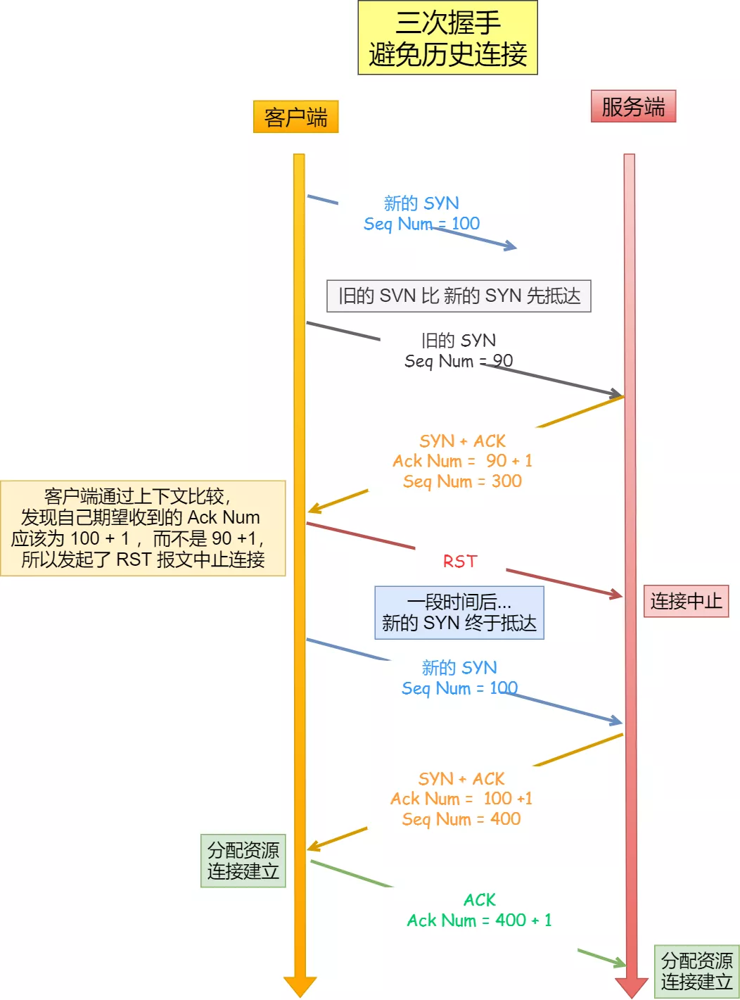
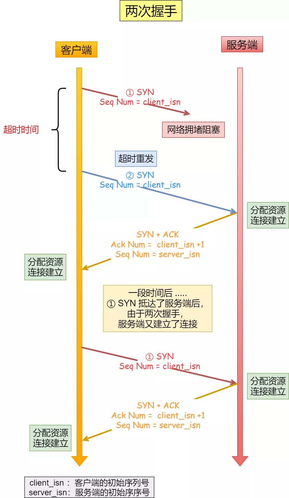
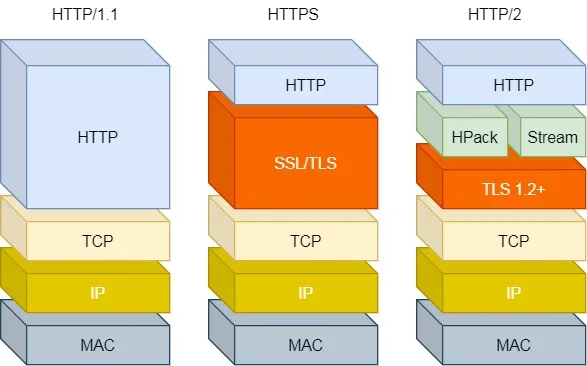
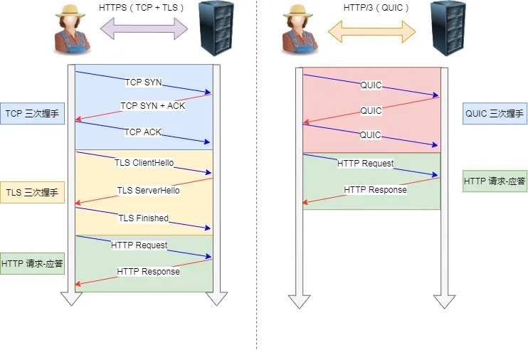
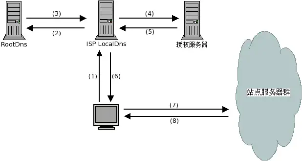
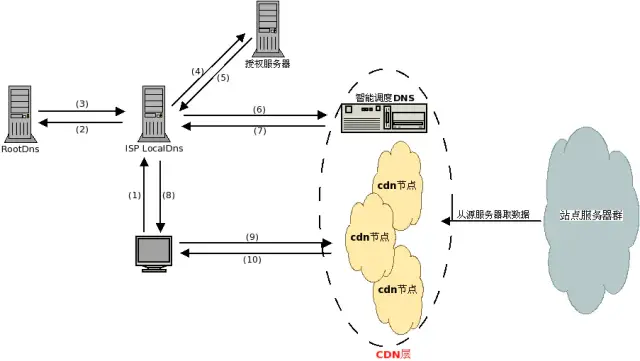

# 网络

## 网络分层

网络协议体系结构的两种国际标准。

* 理论上的国际标准 OSI网络协议体系
* 事实上的国际标准 TCP/IP网络协议体系

OSI七层协议

TCP/IP四层协议

TCP/IP四层体系结构最下层的网络接口层并没有具体内容，因此往往采取折中的方法，即综合OSI和TCP/IP的优点，采用一种只有五层协议的体系结构。

**物理层协议：**

负责0、1 比特流（0/1序列）与电压的高低、逛的闪灭之间的转换。规定了激活、维持、关闭通信端点之间的机械特性、电气特性、功能特性以及过程特性；该层为上层协议提供了一个传输数据的物理媒体，只是说明标准。
在这一层，数据的单位称为比特（bit）（注：bit和字节Byte，我们常说的1字节8位2进制即：1B=8bit）。属于物理层定义的典型规范代表包括：EIA/TIA RS-232、EIA/TIA RS-449、V.35、RJ-45、fddi令牌环网。

**数据链路层协议：**

负责物理层面上的互联的、节点间的通信传输（例如一个以太网项链的2个节点之间的通信）；该层的作用包括：物理地址寻址、数据的成帧、流量控制、数据的检错、重发等。
在这一层，数据的单位称为帧（frame）。数据链路层协议的代表包括：ARP、RARP、SDLC、HDLC、PPP、STP、帧中继等。

**网络层协议：**

将数据传输到目标地址；目标地址可以使多个网络通过路由器连接而成的某一个地址，主要负责寻找地址和路由选择，网络层还可以实现拥塞控制、网际互连等功能。在这一层，数据的单位称为数据包（packet）。网络层协议的代表包括：IP、IPX、RIP、OSPF等。

**传输层协议（核心层）：**

传输层是OSI中最重要、最关键的一层, 是唯一负责总体的数据传输和数据控制的一层；

传输层提供端到端的交换数据的机制，检查分组编号与次序，传输层对其上三层如会话层等，提供可靠的传输服务, 对网络层提供可靠的目的地站点信息主要功能。

在这一层，数据的单位称为数据段（segment）。主要功能：

1：为端到端连接提供传输服务。

2：这种传输服务分为可靠和不可靠的, 其中TCP是典型的可靠传输, 而UDP则是不可靠传输。

3：为端到端连接提供流量控制, 差错控制, 服务质量(Quality of Service, QoS)等管理服务。

包括的协议如下：

TCP：传输控制协议，传输效率低，可靠性强。

UDP：用户数据报协议，适用于传输可靠性要求不高，数据量小的数据。

DCCP、SCTP、RTP、RSVP、PPTP等协议。

**会话层协议：**

负责建立和断开通信连接（数据流动的逻辑通路），记忆数据的分隔等数据传输相关的管理。

**表示层协议：**

将数据格式转换为标准格式。将应用处理的信息转换为适合网络传输的格式，或将来自下一层的数据转换为上层能够处理的格式；主要负责数据格式的转换，确保一个系统的应用层信息可被另一个系统应用层读取。具体来说，就是将设备固有的数据格式转换为网络标准传输格式，不同设备对同一比特流解释的结果可能会不同；因此，主要负责使它们保持一致。

**应用层协议：**

1：超文本传输协议HTTP：这是一种最基本的客户机/服务器的访问协议；浏览器向服务器发送请求，而服务器回应相应的网页。

2：文件传送协议FTP：提供交互式的访问，基于客户服务器模式，面向连接 使用TCP可靠的运输服务。主要功能: 减少/消除不同操作系统下文件的不兼容性。

3：远程登录协议TELNET：客户服务器模式，能适应许多计算机和操作系统的差异，网络虚拟终端NVT的意义。

4：简单邮件传送协议SMTP：Client/Server模式，面向连接。基本功能：写信、传送、报告传送情况、显示信件、接收方处理信件。

5：DNS域名解析协议：DNS是一种用以将域名转换为IP地址的Internet服务。

6：简单文件传送协议TFTP：客户服务器模式，使用UDP数据报，只支持文件传输，不支持交互，TFTP代码占内存小。

7：简单网络管理协议（SNMP）: SNMP模型的4个组件：被管理结点、管理站、管理信息、管理协议。SNMP代理：运行SNMP管理进程的被管理结点。

8：DHCP动态主机配置协议: 发现协议中的引导文件名、空终止符、属名或者空, DHCP供应协议中的受限目录路径名 Options –可选参数字段，参考定义选择列表中的选择文件。

<!-- https://mp.weixin.qq.com/s/iYCzJh5e1KB0Eu4Sj9ToYQ -->

## TCP协议

TCP(Transmission Control Protocol 传输控制协议)是一种面向连接的、可靠的、基于字节流的**传输层**通信协议。

面向连接： 一定是`一对一`才能连接，不能想UDP协议可以一个主机同时向多个主机发送消息

可靠性： 无论网络链路中出现怎么样的链路变化，TCP都可以保证一个报文一定能够到达接收端

字节流： 消息是「没有边界」的，所以无论我们消息有多大都可以进行传输。并且消息是「有序的」，当「前一个」消息没有收到的时候，即使它先收到了后面的字节已经收到，那么也不能扔给应用层去处理，同时对「重复」的报文会自动丢弃。

TCP协议具有的特点：

* 基于流的方式
* 面向连接的传输层协议
* 可靠通信方式
* 在网络状况不佳的时候尽量降低系统由于重传带来的带宽开销
* 通信连接维护是面向通信的两个端点的，而不考虑中间网段和节点

### TCP报文头部

对于 TCP 头部来说，以下几个字段是很重要的

* 序列号 Sequence number，这个序号保证了 TCP 传输的报文都是有序的，对端可以通过序号顺序的拼接报文
* 确认应答号 Acknowledgement Number，这个序号表示数据接收端期望接收的下一个字节的编号是多少，同时也表示上一个序号的数据已经收到
* Window Size，窗口大小，表示还能接收多少字节的数据，用于流量控制
* 标识符
  + URG=1：该字段为一表示本数据报的数据部分包含紧急信息，是一个高优先级数据报文，此时紧急指针有效。紧急数据一定位于当前数据包数据部分的最前面，紧急指针标明了紧急数据的尾部。
  + ACK=1：该字段为一表示确认号字段有效。此外，TCP 还规定在连接建立后传送的所有报文段都必须把 ACK 置为一。
  + PSH=1：该字段为一表示接收端应该立即将数据 push 给应用层，而不是等到缓冲区满后再提交。
  + RST=1：该字段为一表示当前 TCP 连接出现严重问题，可能需要重新建立 TCP 连接，也可以用于拒绝非法的报文段和拒绝连接请求。
  + SYN=1：当SYN=1，ACK=0时，表示当前报文段是一个连接请求报文。当SYN=1，ACK=1时，表示当前报文段是一个同意建立连接的应答报文。
  + FIN=1：该字段为一表示此报文段是一个释放连接的请求报文。

### 什么是TCP连接

什么是连接呢？

简单的说：用于保证可靠性和流量控制维护的某些状态信息，这些信息的组合，包括Socket、序列号和窗口大小称为连接。

所以我们可以知道，建立一个 TCP 连接是需要客户端与服务器端达成上述三个信息的共识。

* Socket：由 IP 地址和端口号组成
* 序列号：用来解决乱序问题等
* 窗口大小：用来做流量控制

#### 如何唯一确定一个 TCP 连接呢？

TCP 四元组可以唯一的确定一个连接，四元组包括如下：

* 源地址
* 源端口
* 目的地址
* 目的端口

源地址和目的地址的字段（32位）是在 IP 头部中，作用是通过 IP 协议发送报文给对方主机。

源端口和目的端口的字段（16位）是在 TCP 头部中，作用是告诉 TCP 协议应该把报文发给哪个进程。

### TCP建立连接（三次握手）

TCP 是面向连接的协议，所以使用 TCP 前必须先建立连接，而建立连接是通过三次握手而进行的。

1. 一开始，客户端和服务端都处于 CLOSED 状态。先是服务端主动监听某个端口，处于 LISTEN 状态

2. 客户端会随机初始化序号（client_isn），将此序号置于 TCP 首部的「序号」字段中，同时把 SYN 标志位置为 1 ，表示 SYN 报文。接着把第一个 SYN 报文发送给服务端，表示向服务端发起连接，该报文不包含应用层数据，之后客户端处于 SYN-SENT 状态。

3. 服务端收到客户端的 SYN 报文后，首先服务端也随机初始化自己的序号（server_isn），将此序号填入 TCP 首部的「序号」字段中，其次把 TCP 首部的「确认应答号」字段填入 client_isn + 1, 接着把 SYN 和 ACK 标志位置为 1。最后把该报文发给客户端，该报文也不包含应用层数据，之后服务端处于 SYN-RCVD 状态

4. 客户端收到服务端报文后，还要向服务端回应最后一个应答报文，首先该应答报文 TCP 首部 ACK 标志位置为 1 ，其次「确认应答号」字段填入 server_isn + 1 ，最后把报文发送给服务端，这次报文可以携带客户到服务器的数据，之后客户端处于 ESTABLISHED 状态。

5. 服务器收到客户端的应答报文后，也进入 ESTABLISHED 状态。

一旦完成三次握手，双方都处于 ESTABLISHED 状态，此致连接就已建立完成，客户端和服务端就可以相互发送数据了。

<!-- 1. 第一次握手 客户端发送SYN（seq=x）报文给服务器端, 进入SYN_SENT状态，等待服务器确认

2. 第二次握手 服务器端收到SYN报文，回应一个SYN （seq=y）ACK（ACK=x+1）报文，进入SYN_RCVD状态。

3. 第三次握手 客户端收到服务器端的SYN报文，回应一个ACK（ACK=y+1）报文，进入ESTABLISHED状态。 -->

#### 为什么是三次握手？不是两次、四次？

从三个方面分析三次握手的原因：

* 三次握手才可以阻止历史重复连接的初始化（主要原因）
* 三次握手才可以同步双方的初始序列号
* 三次握手才可以避免资源浪费

原因一：避免历史链接

RFC 793 指出的 TCP 连接使用三次握手的首要原因：是为了防止旧的重复连接初始化造成混乱。

客户端连续发送多次 SYN 建立连接的报文，在网络拥堵等情况下：

* 超时重发SYN后，新的SYN还没有到达服务端，旧的SYN到达了服务器端

* 那么此时服务端就会回一个 SYN + ACK 报文给客户端；

* 客户端收到后可以根据自身的上下文，判断这是一个历史连接（序列号过期或超时），那么客户端就会发送 RST 报文给服务端，表示中止这一次连接。

如果是两次握手连接，就不能判断当前连接是否是历史连接，三次握手则可以在客户端（发送方）准备发送第三次报文时，客户端因有足够的上下文来判断当前连接是否是历史连接：

* 如果是历史连接（序列号过期或超时），则第三次握手发送的报文是 RST 报文，以此中止历史连接；

* 如果不是历史连接，则第三次发送的报文是 ACK 报文，通信双方就会成功建立连接；

所以， TCP 使用三次握手建立连接的最主要原因是防止历史连接初始化了连接。

原因二：同步双方初始序列号

TCP 协议的通信双方， 都必须维护一个「序列号」， 序列号是可靠传输的一个关键因素，它的作用：

* 接收方可以去除重复的数据；

* 接收方可以根据数据包的序列号按序接收；

* 可以标识发送出去的数据包中， 哪些是已经被对方收到的；

可见，序列号在 TCP 连接中占据着非常重要的作用，所以当客户端发送携带「初始序列号」的 SYN 报文的时候，需要服务端回一个 ACK 应答报文，表示客户端的 SYN 报文已被服务端成功接收，那当服务端发送「初始序列号」给客户端的时候，依然也要得到客户端的应答回应，这样一来一回，才能确保双方的初始序列号能被可靠的同步。

四次握手其实也能够可靠的同步双方的初始化序号，但由于第二步和第三步可以优化成一步，所以就成了「三次握手」。

而两次握手只保证了一方的初始序列号能被对方成功接收，没办法保证双方的初始序列号都能被确认接收。

原因三：避免资源浪费

如果只有「两次握手」，当客户端的 SYN 请求连接在网络中阻塞，客户端没有接收到 ACK 报文，就会重新发送 SYN ，由于没有第三次握手，服务器不清楚客户端是否收到了自己发送的建立连接的 ACK 确认信号，所以每收到一个 SYN 就只能先主动建立一个连接.

如果客户端的 SYN 阻塞了，重复发送多次 SYN 报文，那么服务器在收到请求后就会建立多个冗余的无效链接，造成不必要的资源浪费, 
即两次握手会造成消息滞留情况下，服务器重复接受无用的连接请求 SYN 报文，而造成重复分配资源

总结: 

TCP 建立连接时，通过三次握手能防止历史连接的建立，能减少双方不必要的资源开销，能帮助双方同步初始化序列号。序列号能够保证数据包不重复、不丢弃和按序传输。 

不使用「两次握手」和「四次握手」的原因. 

「两次握手」：无法防止历史连接的建立，会造成双方资源的浪费，也无法可靠的同步双方序列号；

「四次握手」：三次握手就已经理论上最少可靠连接建立，所以不需要使用更多的通信次数。

#### 为什么客户端和服务端的初始序列号 ISN 是不相同的？

因为网络中的报文会延迟、会复制重发、也有可能丢失，这样会造成的不同连接之间产生互相影响，所以为了避免互相影响，客户端和服务端的初始序列号是随机且不同的。

#### 初始序列号 ISN 是如何随机产生的？

起始 ISN 是基于时钟的，每 4 毫秒 + 1，转一圈要 4.55 个小时。

RFC1948 中提出了一个较好的初始化序列号 ISN 随机生成算法。

`ISN = M + F (localhost, localport, remotehost, remoteport)`

M 是一个计时器，这个计时器每隔 4 毫秒加 1。

F 是一个 Hash 算法，根据源 IP、目的 IP、源端口、目的端口生成一个随机数值。要保证 Hash 算法不能被外部轻易推算得出，用 MD5 算法是一个比较好的选择。

### TCP连接终止（四次挥手）

建立一个连接需要三次握手，而终止一个连接要经过四次握手，这是由TCP的半关闭（half-close）造成的

四次挥手（Four-Way Wavehand）指断开一个TCP连接时，需要客户端和服务端总共发送4个包以确认连接的断开。

1. 客户端打算关闭连接，此时会发送一个 TCP 首部 FIN 标志位被置为 1 的报文，也即 FIN 报文，之后客户端进入 FIN_WAIT_1 状态。

2. 服务端收到该报文后，就向客户端发送 ACK 应答报文，接着服务端进入 CLOSED_WAIT 状态。

3. 客户端收到服务端的 ACK 应答报文后，之后进入 FIN_WAIT_2 状态。

4. 等待服务端处理完数据后，也向客户端发送 FIN 报文，之后服务端进入 LAST_ACK 状态。

5. 客户端收到服务端的 FIN 报文后，回一个 ACK 应答报文，之后进入 TIME_WAIT 状态

6. 服务器收到了 ACK 应答报文后，就进入了 CLOSE 状态，至此服务端已经完成连接的关闭。

7. 客户端在经过 2MSL 一段时间后，自动进入 CLOSE 状态，至此客户端也完成连接的关闭。

你可以看到，每个方向都需要一个 FIN 和一个 ACK，因此通常被称为四次挥手。

这里一点需要注意是：主动关闭连接的，才有 TIME_WAIT 状态。

#### 为什么挥手需要四次

关闭连接时，客户端向服务端发送 FIN 时，仅仅表示客户端不再发送数据了但是还能接收数据。

服务器收到客户端的 FIN 报文时，先回一个 ACK 应答报文，而服务端可能还有数据需要处理和发送，等服务端不再发送数据时，才发送 FIN 报文给客户端来表示同意现在关闭连接。

从上面过程可知，服务端通常需要等待完成数据的发送和处理，所以服务端的 ACK 和 FIN 一般都会分开发送，从而比三次握手导致多了一次。

#### 为什么 TIME_WAIT 等待的时间是 2MSL？

MSL 是 Maximum Segment Lifetime，报文最大生存时间，它是任何报文在网络上存在的最长时间，超过这个时间报文将被丢弃。因为 TCP 报文基于是 IP 协议的，而 IP 头中有一个 TTL 字段，是 IP 数据报可以经过的最大路由数，每经过一个处理他的路由器此值就减 1，当此值为 0 则数据报将被丢弃，同时发送 ICMP 报文通知源主机。

MSL 与 TTL 的区别：MSL 的单位是时间，而 TTL 是经过路由跳数。所以 MSL 应该要大于等于 TTL 消耗为 0 的时间，以确保报文已被自然消亡。

TIME_WAIT 等待 2 倍的 MSL，比较合理的解释是：网络中可能存在来自发送方的数据包，当这些发送方的数据包被接收方处理后又会向对方发送响应，所以一来一回需要等待 2 倍的时间。

2MSL 的时间是从客户端接收到 FIN 后发送 ACK 开始计时的。如果在 TIME-WAIT 时间内，因为客户端的 ACK 没有传输到服务端，客户端又接收到了服务端重发的 FIN 报文，那么 2MSL 时间将重新计时。

#### 为什么需要 TIME_WAIT 状态？

主动发起关闭连接的一方，才会有 TIME-WAIT 状态。需要 TIME-WAIT 状态，主要是两个原因：

* 防止具有相同「四元组」的「旧」数据包被收到；
* 保证「被动关闭连接」的一方能被正确的关闭，即保证最后的 ACK 能让被动关闭方接收，从而帮助其正常关闭；

1. 防止旧连接的数据包

假设 TIME-WAIT 没有等待时间或时间过短，被延迟的数据包抵达后会发生什么呢？

如上图黄色框框服务端在关闭连接之前发送的 SEQ = 301 报文，被网络延迟了,这时有相同端口的 TCP 连接被复用后，被延迟的 SEQ = 301 抵达了客户端，那么客户端是有可能正常接收这个过期的报文，这就会产生数据错乱等严重的问题。

所以，TCP 就设计出了这么一个机制，经过 2MSL 这个时间，足以让两个方向上的数据包都被丢弃，使得原来连接的数据包在网络中都自然消失，再出现的数据包一定都是新建立连接所产生的。

2. 保证连接正确关闭

TIME-WAIT 作用是等待足够的时间以确保最后的 ACK 能让被动关闭方接收，从而帮助其正常关闭。

如上图红色框框客户端四次挥手的最后一个 ACK 报文如果在网络中被丢失了，此时如果客户端 TIME-WAIT 过短或没有，则就直接进入了 CLOSE 状态了，那么服务端则会一直处在 LASE-ACK 状态。

当客户端发起建立连接的 SYN 请求报文后，服务端会发送 RST 报文给客户端，连接建立的过程就会被终止。

如果 TIME-WAIT 等待足够长的情况就会遇到两种情况：

* 服务端正常收到四次挥手的最后一个 ACK 报文，则服务端正常关闭连接。

* 服务端没有收到四次挥手的最后一个 ACK 报文时，则会重发 FIN 关闭连接报文并等待新的 ACK 报文。

所以客户端在 TIME-WAIT 状态等待 2MSL 时间后，就可以保证双方的连接都可以正常的关闭。

[参考链接](https://mp.weixin.qq.com/s?__biz=MzUxODAzNDg4NQ==&amp;mid=2247484005&amp;idx=1&amp;sn=cb07ee1c891a7bdd0af3859543190202&amp;chksm=f98e46cfcef9cfd9feb8b9df043a249eb5f226a927fd6d4065e99e62a645a584005d9921541b&scene=158&rd2werd=1#wechat_redirect)

### ARQ协议

ARQ协议也就是超时重传机制。通过确认和超时机制保证了数据的正确送达，ARQ协议包含停止等待ARQ和连续ARQ

#### 停止等待ARQ

**正常传输过程**

只要A向B发送一段报文，都要停止发送并启动一个定时器，等待对端响应，在定时器时间内接受到对端应答就取消定时器发送下一段报文

**报文丢失或出错**

在报文的传输过程中可能会出现丢包的情况。这时候超过定时器设定的时间就会再次发送丢包的数据直到对端响应，所以需要每次都备份发送的数据。

即使报文正常的传输到对端，也可能出现在传输过程中报文报错的问题。这时候对端会抛弃该报文并等待重传。

PS：一般定时器设定的时间都会大于一个 RTT 的平均时间。RTT 表示发送端发送数据到接收到对端数据所需的往返时间。

**ACK 超时或丢失**

对端传输的应答也可能出现丢失或超时的情况。那么超过定时器时间 A 端照样会重传报文。这时候 B 端收到相同序号的报文会丢弃该报文并重传应答，直到 A 端发送下一个序号的报文。

在超时的情况下也可能出现应答很迟到达，这时 A 端会判断该序号是否已经接收过，如果接收过只需要丢弃应答即可。

这个协议的缺点就是传输效率低，在良好的网络环境下每次发送报文都得等待对端的 ACK 。

#### 连续ARQ

在连续 ARQ 中，发送端拥有一个发送窗口，可以在没有收到应答的情况下持续发送窗口内的数据，这样相比停止等待 ARQ 协议来说减少了等待时间，提高了效率。

**累计确认**

连续 ARQ 中，接收端会持续不断收到报文。如果和停止等待 ARQ 中接收一个报文就发送一个应答一样，就太浪费资源了。通过累计确认，可以在收到多个报文以后统一回复一个应答报文。报文中的 ACK 可以用来告诉发送端这个序号之前的数据已经全部接收到了，下次请发送这个序号 + 1的数据。

但是累计确认也有一个弊端。在连续接收报文时，可能会遇到接收到序号 5 的报文后，并未接到序号 6 的报文，然而序号 7 以后的报文已经接收。遇到这种情况时，ACK 只能回复 6，这样会造成发送端重复发送数据，这种情况下可以通过 Sack 来解决，这个会在下文说到

### 滑动窗口

在上面小节中讲到了发送窗口。在 TCP 中，两端都维护着窗口：分别为发送端窗口和接收端窗口。

发送端窗口包含已发送但未收到应答的数据和可以发送但是未发送的数据。

发送端窗口是由接收窗口剩余大小决定的。接收方会把当前接收窗口的剩余大小写入应答报文，发送端收到应答后根据该值和当前网络拥塞情况设置发送窗口的大小，所以发送窗口的大小是不断变化的。

当发送端接收到应答报文后，会随之将窗口进行滑动

滑动窗口实现了流量控制。接收方通过报文告知发送方还可以发送多少数据，从而保证接收方能够来得及接收数据

#### Zero窗口

在发送报文的过程中，可能会遇到对端出现零窗口的情况。在该情况下，发送端会停止发送数据，并启动 persistent timer 。该定时器会定时发送请求给对端，让对端告知窗口大小。在重试次数超过一定次数后，可能会中断 TCP 链接

### 拥塞处理

拥塞处理和流量控制不同，后者是作用于接收方，保证接收方来得及接受数据。而前者是作用于网络，防止过多的数据拥塞网络，避免出现网络负载过大的情况。

拥塞处理包括了四个算法，分别为：慢开始，拥塞避免，快速重传，快速恢复。

#### 慢开始算法

慢开始算法，顾名思义就是在传输开始时将发送窗口慢慢指数级扩大，从而避免一开始就传输大量数据导致网络拥塞。

慢开始算法步骤具体如下：

1. 连接初始设置拥塞窗口（Congestion Window）为1 MSS一个分段的最大数据量）
2. 每过一个RTT就将窗口大小乘二
3. 指数级增长肯定不能没有限制的，所以有一个阀值限制，当窗口大小大于阀值时就会启动拥塞避免算法

#### 拥塞避免算法

拥塞避免算法相比简单点，每过一个RTT窗口大小只加一，这样能够避免指数级增长导致网络拥塞，慢慢将大小调整到最佳值。

在传输过程中可能定时间超时的情况，这时候TCP会认为网络拥塞了，会马上进行以下步骤：

1. 将阀值设为当前拥塞窗口的一半
2. 将拥塞窗口设为1 MSS
3. 启动拥塞避免算法

#### 快速重传

快速重传一般和快恢复一起出现。一旦接收端收到的报文出现失序的情况，接收端只会回复最后一个顺序正确的报文序号。如果收到三个重复的ACK，无需等待定时器超时再重发而是启动快速重传。具体算法分为两种：

TCP Taho 实现如下

* 将阀值设为当前拥塞窗口的一半
* 将拥塞窗口设为1 MSS
* 重新开始慢开始算法

TCP Reno 实现如下

* 拥塞窗口减半
* 将阀值设为当前拥塞窗口
* 进入快恢复阶段（重发对端需要的包，一旦收到一个新的 ACK 答复就退出该阶段）
* 使用拥塞避免算法

TCP New Ren 改进后的快恢复

TCP New Reno 算法改进了之前 TCP Reno 算法的缺陷。在之前，快恢复中只要收到一个新的 ACK 包，就会退出快恢复。

在 TCP New Reno 中，TCP 发送方先记下三个重复 ACK 的分段的最大序号。

假如我有一个分段数据是 1 ~ 10 这十个序号的报文，其中丢失了序号为 3 和 7 的报文，那么该分段的最大序号就是 10。发送端只会收到 ACK 序号为 3 的应答。这时候重发序号为 3 的报文，接收方顺利接收并会发送 ACK 序号为 7 的应答。这时候 TCP 知道对端是有多个包未收到，会继续发送序号为 7 的报文，接收方顺利接收并会发送 ACK 序号为 11 的应答，这时发送端认为这个分段接收端已经顺利接收，接下来会退出快恢复阶段。

## UDP协议

UDP 是User Datagram Protocol的简称， 中文名是用户数据报协议，是OSI（Open System Interconnection，开放式系统互联） 参考模型中一种无连接的传输层协议，提供面向事务的简单不可靠信息传送服务，IETF RFC 768是UDP的正式规范。UDP在IP报文的协议号是17。

### 特性

1. UDP是面向报文的

UDP 是一个面向报文（报文可以理解为一段段的数据）的协议。意思就是 UDP 只是报文的搬运工，不会对报文进行任何拆分和拼接操作

具体来说：

* 在发送端，应用层将数据传递给传输层的 UDP 协议，UDP 只会给数据增加一个 UDP 头标识下是 UDP 协议，然后就传递给网络层了
* 在接收端，网络层将数据传递给传输层，UDP 只去除 IP 报文头就传递给应用层，不会任何拼接操作

2. 不可靠性

* UDP 是无连接的，也就是说通信不需要建立和断开连接。
* 协议收到什么数据就传递什么数据，并且也不会备份数据，对方能不能收到是不关心的
* UDP 没有拥塞控制，一直会以恒定的速度发送数据。即使网络条件不好，也不会对发送速率进行调整。这样实现的弊端就是在网络条件不好的情况下可能会导丢包，但是优点也很明显，在某些实时性要求高的场景（比如电话会议）就需要使用 UDP 而不是 TCP。

3. 高效性

因为 UDP 没有 TCP 那么复杂，需要保证数据不丢失且有序到达。所以 UDP 的头部开销小，只有八字节，相比 TCP 的至少二十字节要少得多，在传输数据报文时是很高效的。

头部包含了以下几个数据

* 两个十六位的端口号，分别为源端口（可选字段）和目标端口
* 整个数据报文的长度
* 整个数据报文的检验和（IPv4 可选 字段），该字段用于发现头部信息和数据中的错误

4. 一对多传输

UDP 不止支持一对一的传输方式，同样支持一对多，多对多，多对一的方式，也就是说 UDP 提供了单播，多播，广播的功能。

### TCP协议和UDP协议的区别

1. 连接

* TCP 是面向连接的传输层协议，传输数据前先要建立连接。

* UDP 是不需要连接，即刻传输数据。

2. 服务对象

* TCP 是一对一的两点服务，即一条连接只有两个端点。

* UDP 支持一对一、一对多、多对多的交互通信

3. 可靠性

* TCP 是可靠交付数据的，数据可以无差错、不丢失、不重复、按需到达。

* UDP 是尽最大努力交付，不保证可靠交付数据。

4. 拥塞控制、流量控制

* TCP 有拥塞控制和流量控制机制，保证数据传输的安全性。

* UDP 则没有，即使网络非常拥堵了，也不会影响 UDP 的发送速率。

5. 首部开销

* TCP 首部长度较长，会有一定的开销，首部在没有使用「选项」字段时是 20 个字节，如果使用了「选项」字段则会变长的。

* UDP 首部只有 8 个字节，并且是固定不变的，开销较小。

## HTTP

HTTP 协议是 Hyper Text Transfer Protocol (超文本传输协议)的缩写，是用于从万维网服务器传输超文本到本来浏览器的传送协议。基于TCP/IP通信协议来传递数据。它是一个**无状态的请求/响应协议**

HTTP 使用统一资源标识符（Uniform Resource Identifiers, URI） 来传输数据和建立连接。URL是一种特殊类型的URI。

HTTP 是一个在计算机世界里专门在「两点」之间「传输」文字、图片、音频、视频等「超文本」数据的「约定和规范」。

### Request

客户端发送一个HTTP请求到服务器的请求消息包括以下格式：请求行（request line）、请求头部（header）、空行和请求数据四个部分组成，下图给出了请求报文的一般格式。

1. 第一部分： 请求行，用来说明请求类型，要访问的资源以及使用的HTTP的版本

2. 第二部分：请求头部，紧接着请求行（即第一行）之后的部分，用来说明服务器要使用的附加信息

3. 第三部分：空行，请求头部后面的空行是必须的

4. 第四部分：请求数据也叫主体，可以添加任意的其他数据。

### Response

HTTP响应也由四个部分组成，分别是：状态行、消息报头、空行和响应正文。

1. 第一部分： 状态行，由HTTP协议版本号，状态码，状态消息 三部分组成

2. 第二部分：消息报头，用来说明客户端要使用的一些附加信息

3. 第三部分：空行，消息报头后面的空行是必须的

4. 第四部分：响应正文，服务器返回客户端的文本信息

### 请求方式

HTTP1.0定义了三种请求方法： GET, POST 和 HEAD方法。

HTTP1.1新增了五种请求方法：OPTIONS, PUT, DELETE, TRACE 和 CONNECT 方法。

1. GET      请求指定的页面信息，并返回实体主体。
2. HEAD     类似于get请求，只不过返回的响应中没有具体的内容，用于获取报头
3. POST     向指定资源提交数据进行处理请求（例如提交表单或者上传文件）。数据被包含在请求体中。POST请求可能会导致      新的资源的建立和/或已有资源的修改。
4. PUT      从客户端向服务器传送的数据取代指定的文档的内容。
5. DELETE   请求服务器删除指定的页面。
6. CONNECT  HTTP/1.1协议中预留给能够将连接改为管道方式的代理服务器。
7. OPTIONS  允许客户端查看服务器的性能。
8. TRACE    回显服务器收到的请求，主要用于测试或诊断。

### POST 和 GET 的区别

先引入副作用和幂等的概念。

副作用指对服务器上的资源做改变，搜索是无副作用的，注册是副作用的。

幂等指发送 M 和 N 次请求（两者不相同且都大于 1），服务器上资源的状态一致，比如注册 10 个和 11 个帐号是不幂等的，对文章进行更改 10 次和 11 次是幂等的。

在规范的应用场景上说，Get 多用于无副作用，幂等的场景，例如搜索关键字。Post 多用于副作用，不幂等的场景，例如注册。

1. 从缓存的角度，GET 请求会被浏览器主动缓存下来，留下历史记录，而 POST 默认不会。
2. 从编码的角度，GET 只能进行 URL 编码，只能接收 ASCII 字符，而 POST 没有限制。
3. 从参数的角度，GET 一般放在 URL 中，因此不安全，POST 放在请求体中，更适合传输敏感信息。
4. 从幂等性的角度，GET是幂等的，而POST不是。(幂等表示执行相同的操作，结果也是相同的)
5. 从TCP的角度，GET 请求会把请求报文一次性发出去，而 POST 会分为两个 TCP 数据包，首先发 header 部分，如果服务器响应 100(continue)， 然后发 body 部分。(火狐浏览器除外，它的 POST 请求只发一个 TCP 包)

### 状态码

状态代码有三位数字组成，第一个数字定义了响应的类别，共分五种类别：

1xx: 指示信息 -- 表示请求已接收，继续处理

2xx: 成功 -- 表示请求已被成功接收、理解、接受

3xx: 重定向 -- 表示要完成请求必须进行更进一步的操作

4xx: 客户端错误 —- 表示请求有语法错误或请求无法实现

5xx: 服务器端错误 -- 表示服务器未能实现合法的请求

常见状态码：

2xx:

* 200 OK 表示从客户端发来的请求在服务器端被正确处理
* 204 No content 表示请求成功，但响应报文不含实体的主体部分
* 205 Reset Content 表示请求成功，但响应报文不含实体的主体部分，但是与204响应不同在于要求请求方重置内容
* 206 Partial Content 进行范围请求

3xx

* 301 Moved Permanently, 永久性重定向，表示资源已被分配了新的URL
* 302 Found 临时性重定向，表示资源临时被分配了新的URL
* 303 See Other 表示资源存在着另一个URL，应使用GET方法获取资源
* 304 Not Modified 表示服务器允许访问资源，但因发生请求未满足条件的情况
* 307 Temporary Redirect 临时重定向 和302含义类似，但是期望客户端保持请求方法不变向新的地址发出请求

4xx 

* 400 Bad Request 请求报文存在语法错误
* 401 Unauthorized 表示发送的请求需要通过HTTP认证的认证信息
* 403 Forbidden 表示对请求资源的访问被服务器拒绝
* 404 Not Found 表示在服务器上没有找到请求的资源

5xx

* 500 Internal Server Error 表示服务器端在执行请求时发生了错误
* 501 Not Implemented 表示服务器不支持当前请求所需要的某个功能
* 502 Bad Gateway 服务器自身是正常的，但访问的时候出错了，啥错误咱也不知道。
* 503 Service Unavailable 表示服务器暂时处于超负载或正在停机维护，无法处理请求

### 首部字段

HTTP首部字段根据实际用途被分为以下4中类型

* 通用首部字段（General Header Fields） 请求报文和响应报文都会使用的首部
* 请求首部字段 (Request Header Fields) 客服端向服务器端发送请求报文时使用的首部
* 响应首部字段 (Response Header Fields) 服务器端向客户端返回响应报文时使用的首部。
* 实体首部字段 (Entity Header Fields) 针对请求报文和响应报文的实体部分使用的首部

#### 通用首部字段

| 首部字段名         | 说明                                                   |
|-------------------|--------------------------------------------------------|
| Cache-Control     | 用来指定当前的请求/回复中的，是否使用缓存机制。                 |
| Connection        | 客户端想要优先使用的连接类型                               |
| Date              | 发送该消息的日期和时间（以RFC 7231中定义的"HTTP日期"格式来发送） |
| Pragma            | 报文指令                                                |
| Trailer           | 报文末端的首部一览                                        |
| Transfer-Encoding | 指定报文主体的传输编码方式                                 |
| Upgrade           | 升级为其他协议                                           |
| Via               | 代理服务器的相关信息                                      |
| Warning           | 错误通知                                                |

#### 请求首部字段

| 首部字段名         | 说明                  |
|-------------------|-----------------------|
| Accept            | 用户代理可以处理的媒体类型 |
| Accept-Charset    | 优先的字符集            |
| Accept-Encoding   | 优先的内容编码          |
| Authorization     | Web认证信息            |
| Except            | 期待服务器的特定行为     |
| Host              | 请求资源所在的服务器     |
| if-Match          | 比较实体标记（ETag）      |
| if-Modified-Since | 比较资源的更新时间       |
| Range             | 实体的字节范围请求       |
| Refer             | 实体的字节范围请求       |
| TE                | 传输编码的优先级        |
| User-Agent        | HTTP客户端程序的信息    |

#### 响应首部字段

| 响应头              | 说明                    |
|--------------------|-------------------------|
| Accept-Ranges      | 是否接受字节范围请求       |
| Age                | 推算资源创建经过的时间     |
| ETag               | 资源的匹配信息            |
| Location           | 令客户端重定向至指定UPI    |
| Proxy-Authenticate | 代理服务器对客户端的认证信息 |
| WWW-Authenticate   | 服务器对客户端的认证信息    |
| Server             | HTTP服务器的安装信息      |
| Vary               | 代理服务器的管理信息       |

####  实体首部字段

| 响应头            | 说明               |
|------------------|--------------------|
| Allow            | 资源可支持的HTTP方法 |
| Content-Encoding | 实体主体适用的编码方式 |
| Content-Language | 实体主体的自然语言    |
| Content-Length   | 实体主体的大小       |
| Content-Location | 替代对应资源的URI    |
| Content-MD5      | 实体主体的报文摘要    |
| Content-Range    | 实体主体的位置范围    |
| Content-Type     | 实体主体的媒体类型    |
| Expires          | 实体主体过期的日期时间 |
| Last-Modified    | 资源的最后修改日期时间 |

### 特性与缺点

HTTP特性 

最凸出的优点是 简单、灵活和易于扩展、应用广泛和跨平台

1. 简单

HTTP 基本的报文格式就是 `header + body` 、头部信息也是 `key-value` 简单文本的形式，易于理解，降低了学习和使用门槛

2. 灵活和易于扩展

HTTP 协议里的各类请求方法，URI/URL、状态码、头字段等每个组成要求都没有被固定死，都允许开发人员自定义和扩充

3. 应用广泛和跨平台

HTTP 应用于手机和PC浏览器都有。

HTTP缺点

1. 无状态双刃剑

无状态的好处，因为服务器不会去记忆 HTTP 的状态，所以不需要额外的资源来记录状态信息，这能减轻服务器的负担，能够把更多的 CPU 和内存用来对外提供服务。

无状态的坏处，既然服务器没有记忆能力，它在完成有关联性的操作时会非常麻烦。

例如登录->添加购物车->下单->结算->支付，这系列操作都要知道用户的身份才行。但服务器不知道这些请求是有关联的，每次都要问一遍身份信息。

对于无状态的问题，解法方案有很多种，其中比较简单的方式用 Cookie 技术。

2. 明文传输双刃剑

明文意味着在传输过程中的信息，是可方便阅读的，通过浏览器的 F12 控制台可以直接肉眼查看，为我们调试工作带了极大的便利性。但是这正是这样，HTTP 的所有信息都暴露在了光天化日下，相当于信息裸奔

3. 不安全性

* 通信使用明文，可能被窃听
* 不验证通信方的身份，可能遭遇伪装
* 无法证明报文的完整性，有可能遭遇篡改

## HTTPS

HTTPS （全称：Hyper Text Transfer Protocol over SecureSocket Layer），是以安全为目标的 HTTP 通道，在HTTP的基础上通过传输加密和身份认证保证了传输过程的安全性。HTTPS 在HTTP 的基础下加入SSL 层，HTTPS 的安全基础是 SSL，因此加密的详细内容就需要 SSL。

HTTP +  加密 + 认证 +  完整性保护 = HTTPS

### SSL/TLS 

SSL 即安全套接层（Secure Sockets Layer），在 OSI 七层模型中处于会话层(第 5 层)。之前 SSL 出过三个大版本，当它发展到第三个大版本的时候才被标准化，成为 TLS（传输层安全，Transport Layer Security），并被当做 TLS1.0 的版本，准确地说，TLS1.0 = SSL3.1。当前大多浏览器使用的是TSL1.2版本

在对SSL进行理解之前，我们先来了解一下加密方法。SSL采用一种叫做**公开密钥加密（Public-key cryptography）**的加密处理方式

#### 共享密钥加密（对称加密)

加密和解密同用一个密钥的方式称为共享密钥加密（Common key crypto system）也被叫做对称密钥加密

以共享密钥方式加密时必须将密钥也发给对方。这就存在一个问题，如何安全的转交密钥呢。如果被监听那么加密也就失效了。

#### 公开密钥加密（非对称加密）

公开密钥加密方式很好的解决了共享密钥的困境

公开密钥加密使用一对非对称的密钥。一把叫做私有密钥（private key） 另一把叫做公开密钥（public key）. 顾名思义，私有密钥是别人不知道的，而公有密钥则是可以发送任何人都可以知道的。

使用公开密钥加密方式。发送密文的一方使用**对方的公钥**进行加密，对方收到加密信息之后，使用自己的私钥进行解密。这种方式不需要发送私钥给给人，那就避免了解密的可能。而且根据加密的信息和公约反向破加密文是相当难的，现阶段是不可能实现的。

#### 混合加密机制

混合加密机制是指共享密钥加密和公开密钥加密两者并用。

HTTPS 就是采用的这种方式。你可能会有疑问 公开密钥加密 不是可以做到信息不会被获取了吗 为什么不被采用。其实理论上是可以的，但是现实很骨感。因为公开密钥加密需要的计算量非常大，对于稍微大一点的数据即使用最快的处理器也非常耗时，速度慢。所以要充分发挥两者的优势。

具体的操作就是 使用公开密钥加密（非对称加密）交换密钥，之后的建立通信交换报文阶段则使用共享密钥加密（对称加密)。

#### 证书

其实公开密钥加密（非对称加密）并不是完美的，那就是无法证明公开密钥本身就是真的密钥。（真假美猴王知道吗，都说自己是真的）为了解决这个问题可以使用数字证书机构（CA）和其相关机关颁发的公开密钥证书。

数字证书认证机构处于客户端和服务器双方都可以信赖的第三方机构的立场上。

### SSL握手阶段

"握手阶段"涉及四次通信

1. step1 客户端发出请求 ClientHello

首先，客户端（通常是浏览器）先向服务器发出加密通信的请求，这被叫做ClientHello请求。会携带上一下信息：

* 支持的协议版本
* 一个客户端生成的随机数，用于之后生成"对话密钥"
* 支持的加密方法，比如RSA公钥加密
* 支持的压缩方法

2. step2 服务器回应 ServerHello

服务器收到客户端请求后，向客户端发出回应，这叫做SeverHello。服务器的回应包含以下内容:

* 确认使用到的加密通信协议版本，如果浏览器和服务器支持的版本不一致，服务器关闭加密通信
* 一个服务器生成的随机数，用于之后生成的"对话密钥"
* 确认使用的加密方法，比如RSA公钥加密
* 服务器证书

3. step3 客户端回应

客户端收到服务器回应以后，首先验证服务器证书。如果证书不是可信机构颁布、或者证书中的域名与实际域名不一致、或者证书已经过期，就会向访问者显示一个警告，由其选择是否还要继续通信。

如果证书没有问题，客户端就会从证书中取出服务器的公钥。然后，向服务器发送下面三项信息：

* 一个随机数。该随机数用服务器公钥加密，防止被窃听。
* 编码改变通知，表示随后的信息都将用双方商定的加密方法和密钥发送。
* 客户端握手结束通知，表示客户端的握手阶段已经结束。这一项同时也是前面发送的所有内容的hash值，用来供服务器校验。

到这一步客户端和服务器就同时有了三个随机数，接着双方就用事先商定的加密方法，各自生成本次会话所用的同一把"会话密钥"。

至于为什么一定要用三个随机数，来生成"会话密钥:

"不管是客户端还是服务器，都需要随机数，这样生成的密钥才不会每次都一样。由于SSL协议中证书是静态的，因此十分有必要引入一种随机因素来保证协商出来的密钥的随机性。

对于RSA密钥交换算法来说，pre-master-key本身就是一个随机数，再加上hello消息中的随机，三个随机数通过一个密钥导出器最终导出一个对称密钥。

pre master的存在在于SSL协议不信任每个主机都能产生完全随机的随机数，如果随机数不随机，那么pre master secret就有可能被猜出来，那么仅适用pre master secret作为密钥就不合适了，因此必须引入新的随机因素，那么客户端和服务器加上pre master secret三个随机数一同生成的密钥就不容易被猜出了，一个伪随机可能完全不随机，可是是三个伪随机就十分接近随机了，每增加一个自由度，随机性增加的可不是一。"

4. 服务器的最后回应

服务器收到客户端的第三个随机数pre-master key之后，计算生成本次会话所用的"会话密钥"。然后，向客户端最后发送下面信息

* 编码改变通知，表示随后的信息都将用双方商定的加密方法和密钥发送。
* 服务器握手结束通知，表示服务器的握手阶段已经结束。这一项同时也是前面发送的所有内容的hash值，用来供客户端校验。

### HTTPS缺点

1. 增加延时

分析前面的握手过程，一次完整的握手至少需要两端依次来回两次通信，至少增加延时2* RTT，利用会话缓存从而复用连接，延时也至少1* RTT

2. 消耗较多的CPU资源

HTTPS通信主要包括对对称加解密、非对称加解密(服务器主要采用私钥解密数据) 这都是耗cpu性能的

3. 费用相对比较贵

相对比http需要购买证书

##  HTTP/1.1、HTTP/2、HTTP/3

### HTTP/1.1

**HTTP/1.1 相比 HTTP/1.0 性能上的改进**

1. 改进持久连接 Connection: keep-alive

HTTP/1.0 每进行一次 HTTP 通信，都需要经历建立 TCP 连接、传输 HTTP 数据和断开 TCP 连接三个阶段

HTTP/1.1 中增加了持久连接的方法，它的特点是在一个 TCP 连接上可以传输多个 HTTP 请求，只要浏览器或者服务器没有明确断开连接，那么该 TCP 连接会一直保持。

HTTP/1.1中的一个tcp链接同时只能发起一个http请求！浏览器会让每个域名同时最多建立6个tcp链接，也就是说同一个域名同时能支持6个http请求！

2. 不成熟的 HTTP 管线化

HTTP/1.1 中试图通过管线化的技术来解决队头阻塞的问题。HTTP/1.1 中的管线化是指将多个 HTTP 请求整批提交给服务器的技术，虽然可以整批发送请求，不过服务器依然需要根据请求顺序来回复浏览器的请求。

FireFox、Chrome 都做过管线化的试验，但是由于各种原因，它们最终都放弃了管线化技术。

3. 提供虚拟主机的支持

在 HTTP/1.0 中，每个域名绑定了一个唯一的 IP 地址，因此一个服务器只能支持一个域名。HTTP/1.1 的请求头中增加了 Host 字段，用来表示当前的域名地址，这样服务器就可以根据不同的 Host 值做不同的处理。

4. 对动态生成的内容提供了完美支持

在设计 HTTP/1.0 时，需要在响应头中设置完整的数据大小，如Content-Length: 901，这样浏览器就可以根据设置的数据大小来接收数据。不过随着服务器端的技术发展，很多页面的内容都是动态生成的，因此在传输数据之前并不知道最终的数据大小，这就导致了浏览器不知道何时会接收完所有的文件数据。

HTTP/1.1 通过引入 Chunk transfer 机制来解决这个问题，服务器会将数据分割成若干个任意大小的数据块，每个数据块发送时会附上上个数据块的长度，最后使用一个零长度的块作为发送数据完成的标志。这样就提供了对动态内容的支持。

**HTTP/1.1 性能瓶颈**
* 请求 / 响应头部（Header）未经压缩就发送，首部信息越多延迟越大。只能压缩 Body 的部分
* 发送冗长的首部。每次互相发送相同的首部造成的浪费较多；
* 服务器是按请求的顺序响应的，如果服务器响应慢，会招致客户端一直请求不到数据，也就是队头阻塞；
* 没有请求优先级控制；
* 请求只能从客户端开始，服务器只能被动响应。

影响 HTTP/1.1 效率的三个主要因素：TCP 的慢启动、多条 TCP 连接竞争带宽和队头阻塞。

### HTTP/2

HTTP 2.0 相对比于 HTTP 1.x 可以说是大幅度提高了web性能。HTTP/2 协议是基于 HTTPS 的，所以 HTTP/2 的安全性也是有保障的。

HTTP 1.x 存在一个队头阻塞的问题。

#### Header压缩

在HTTP1.x中，使用文本的形式传输header，在header携带cookie的情况下，可能每次都需要重复传输几百到几千的字节。

在HTTP2.0中，使用了HPACK压缩格式对传输的header进行编码，减少了header的大小。并在两端维护了索引表，用于记录出现过的header，后面再传输过程中就可以传输已经记录过的header的键名，对端收到数据后就可以通过键名找到对应的值。

#### 二进制传输

在HTTP2.0版本之前，是通过文本的方式传输数据。在2.0版本中引入了新的编码机制，所有传输的数据都会被分割，并采用二进制格式编码。这是2.0版本加强性能的核心点

在二进制传输中， HTTP/2 会将所有传输的信息分割为更小的消息和帧（frame）, 并对它们采用二进制格式的编码 ，其中 HTTP1.x 的首部信息会被封装到 HEADER frame，而相应的 Request Body 则封装到 DATA frame 里面。

这样虽然对人不友好，但是对计算机非常友好，因为计算机只懂二进制，那么收到报文后，无需再将明文的报文转成二进制，而是直接解析二进制报文，这增加了数据传输的效率。

#### 数据流

HTTP/2 的数据包不是按顺序发送的，同一个连接里面连续的数据包，可能属于不同的回应。因此，必须要对数据包做标记，指出它属于哪个回应。

每个请求或回应的所有数据包，称为一个数据流（Stream）。

每个数据流都标记着一个独一无二的编号，其中规定客户端发出的数据流编号为奇数， 服务器发出的数据流编号为偶数

客户端还可以指定数据流的优先级。优先级高的请求，服务器就先响应该请求。

#### 多路复用

HTTP/2 是可以在一个连接中并发多个请求或回应，而不用按照顺序一一对应。

移除了 HTTP/1.1 中的串行请求，不需要排队等待，也就不会再出现「队头阻塞」问题，降低了延迟，大幅度提高了连接的利用率。

在HTTP2.0中，有两个非常重要的概念，分别是帧（frame） 和流（stream）。

帧代表着最小的数据单位，每个帧会标识出该帧属于哪个流，流也就是多个帧组成的数据流。

多路复用，就是在一个TCP链接中可以存在多条流。换句话说，也就是可以发送多个请求，对端可以通过帧中的标识知道属于哪个请求。通过这个技术，可以避免HTTP旧版中的队头阻塞问题，极大的提高传输性能。

**多路复用的实现**

从图中可以看出，HTTP/2 添加了一个二进制分帧层，那我们就结合图来分析下 HTTP/2 的请求和接收过程。

* 首先，浏览器准备好请求数据，包括了请求行、请求头等信息，如果是 POST 方法，那么还要有请求体。
* 这些数据经过二进制分帧层处理之后，会被转换为一个个带有请求 ID 编号的帧，通过协议栈将这些帧发送给服务器
* 服务器接收到所有帧之后，会将所有相同 ID 的帧合并为一条完整的请求信息。
* 然后服务器处理该条请求，并将处理的响应行、响应头和响应体分别发送至二进制分帧层。
* 同样，二进制分帧层会将这些响应数据转换为一个个带有请求 ID 编号的帧，经过协议栈发送给浏览器。
* 浏览器接收到响应帧之后，会根据 ID 编号将帧的数据提交给对应的请求。

#### 服务端Push

HTTP/2 还在一定程度上改善了传统的「请求 - 应答」工作模式，服务不再是被动地响应，也可以主动向客户端发送消息。

举例来说，在浏览器刚请求 HTML 的时候，就提前把可能会用到的 JS、CSS 文件等静态资源主动发给客户端，减少延时的等待，也就是服务器推送（Server Push，也叫 Cache Push）。

#### HTTP2.0缺陷

1.  TCP 的队头阻塞

在 TCP 传输过程中，由于单个数据包的丢失而造成的阻塞称为 TCP 上的队头阻塞。

在 HTTP/2 中，多个请求是跑在一个 TCP 管道中的，如果其中任意一路数据流中出现了丢包的情况，那么就会阻塞该 TCP 连接中的所有请求

这不同于 HTTP/1.1，使用 HTTP/1.1 时，浏览器为每个域名开启了 6 个 TCP 连接，如果其中的 1 个 TCP 连接发生了队头阻塞，那么其他的 5 个连接依然可以继续传输数据。

所以随着丢包率的增加，HTTP/2 的传输效率也会越来越差。有测试数据表明，当系统达到了 2% 的丢包率时，HTTP/1.1 的传输效率反而比 HTTP/2 表现得更好。

2. TCP 建立连接的延时

除了 TCP 队头阻塞之外，TCP 的握手过程也是影响传输效率的一个重要因素。

先理解一个概念 网络延迟又称为 RTT（Round Trip Time）。我们把从浏览器发送一个数据包到服务器，再从服务器返回数据包到浏览器的整个往返时间称为 RTT（如下图）。RTT 是反映网络性能的一个重要指标。

那建立 TCP 连接时，需要花费多少个 RTT 呢？下面我们来计算下

HTTP/1 和 HTTP/2 都是使用 TCP 协议来传输的，而如果使用 HTTPS 的话，还需要使用 TLS 协议进行安全传输，而使用 TLS 也需要一个握手过程，这样就需要有两个握手延迟过程。

1. 在建立 TCP 连接的时候，需要和服务器进行三次握手来确认连接成功，也就是说需要在消耗完 1.5 个 RTT 之后才能进行数据传输。

2. 进行 TLS 连接，TLS 有两个版本——TLS1.2 和 TLS1.3，每个版本建立连接所花的时间不同，大致是需要 1～2 个 RTT

总之，在传输数据之前，我们需要花掉 3～4 个 RTT。如果浏览器和服务器的物理距离较近，那么 1 个 RTT 的时间可能在 10 毫秒以内，也就是说总共要消耗掉 30～40 毫秒。这个时间也许用户还可以接受，但如果服务器相隔较远，那么 1 个 RTT 就可能需要 100 毫秒以上了，这种情况下整个握手过程需要 300～400 毫秒，这时用户就能明显地感受到“慢”了。

3. TCP 协议僵化

中间设备有很多种类型，并且每种设备都有自己的目的，这些设备包括了路由器、防火墙、NAT、交换机等。

它们通常依赖一些很少升级的软件，这些软件使用了大量的 TCP 特性，这些功能被设置之后就很少更新了。所以，如果我们在客户端升级了 TCP 协议，但是当新协议的数据包经过这些中间设备时，它们可能不理解包的内容，于是这些数据就会被丢弃掉。这就是中间设备僵化，它是阻碍 TCP 更新的一大障碍。

除了中间设备僵化外，操作系统也是导致 TCP 协议僵化的另外一个原因。因为 TCP 协议都是通过操作系统内核来实现的，应用程序只能使用不能修改。通常操作系统的更新都滞后于软件的更新，因此要想自由地更新内核中的 TCP 协议也是非常困难的。

### HTTP/3

HTTP/2 存在一些比较严重的与 TCP 协议相关的缺陷，但由于 TCP 协议僵化，我们几乎不可能通过修改 TCP 协议自身来解决这些问题，那么解决问题的思路是绕过 TCP 协议

UDP 发生是不管顺序，也不管丢包的，所以不会出现 HTTP/1.1 的队头阻塞 和 HTTP/2 的一个丢包全部重传问题。

大家都知道 UDP 是不可靠传输的，但基于 UDP 的 QUIC 协议 可以实现类似 TCP 的可靠性传输。

* QUIC 有自己的一套机制可以保证传输的可靠性的。当某个流发生丢包时，只会阻塞这个流，其他流不会受到影响。

* TLS 升级成了最新的 1.3 版本，头部压缩算法也升级成了 QPack。

* HTTPS 要建立一个连接，要花费 6 次交互，先是建立三次握手，然后是 TLS/1.3 的三次握手。QUIC 直接把以往的 TCP 和 TLS/1.3 的 6 次交互合并成了 3 次，减少了交互次数。

* 由于 QUIC 是基于 UDP 的，所以 QUIC 可以实现使用 0-RTT 或者 1-RTT 来建立连接.

所以， QUIC 是一个在 UDP 之上的伪 TCP + TLS + HTTP/2 的多路复用的协议。

HTTP/3 的挑战

1. 从目前的情况来看，服务器和浏览器端都没有对 HTTP/3 提供比较完整的支持。Chrome 虽然在数年前就开始支持 Google 版本的 QUIC，但是这个版本的 QUIC 和官方的 QUIC 存在着非常大的差异。

2. 部署 HTTP/3 也存在着非常大的问题。因为系统内核对 UDP 的优化远远没有达到 TCP 的优化程度，这也是阻碍 QUIC 的一个重要原因。

3. 中间设备僵化的问题。这些设备对 UDP 的优化程度远远低于 TCP，据统计使用 QUIC 协议时，大约有 3%～7% 的丢包率。

HTTP/1 ~ HTTP/3 版本演变过程

## DNS

DNS 的作用就是通过域名查询到具体的 IP。

因为 IP 存在数字和英文的组合（IPv6），很不利于人类记忆，所以就出现了域名。你可以把域名看成是某个 IP 的别名，DNS 就是去查询这个别名的真正名称是什么。

因为 IP 存在数字和英文的组合（IPv6），很不利于人类记忆，所以就出现了域名。你可以把域名看成是某个 IP 的别名，DNS 就是去查询这个别名的真正名称是什么。

在 TCP 握手之前就已经进行了 DNS 查询，这个查询是操作系统自己做的。当你在浏览器中想访问 www.google.com 时，会进行一下操作：

1. 操作系统会首先在本地缓存中查询
2. 没有的话会去系统配置的 DNS 服务器中查询
3. 如果这时候还没得话，会直接去 DNS 根服务器查询，这一步查询会找出负责 com 这个一级域名的服务器
4. 然后去该服务器查询 google 这个二级域名
5. 接下来三级域名的查询其实是我们配置的，你可以给 www 这个域名配置一个 IP，然后还可以给别的三级域名配置一个 IP

以上介绍的是 DNS 迭代查询，还有种是递归查询，区别就是前者是由客户端去做请求，后者是由系统配置的 DNS 服务器做请求，得到结果后将数据返回给客户端。

PS：DNS 是基于 UDP 做的查询。

## 地址栏输入URL到页面展示的过程

1. 用户输入关键字并键入回车，浏览器导航栏显示loading状态
2. 浏览器会判断输入的关键字是搜索内容，还是请求的 URL。
    * 如果是搜索内容，地址栏会使用浏览器默认的搜索引擎，来合成新的带搜索关键字的 URL
    * 如果判断输入内容符合 URL 规则，那么会根据规则，把这段内容加上协议，合成为完整的 URL
3. 浏览器进程通过进程间通信（IPC）把url请求发送给网络进程
4. 网络进程接收到url请求后检查本地缓存是否缓存了该请求资源，如果有则将该资源返回给浏览器进程
5. 如果没有，网络进程向web服务器发起http请求（网络请求），请求流程如下：
    * 进行DNS解析，获取服务器ip地址，端口，如果没有端口号，http默认80，https默认443（DNS解析过程补充）
    * 利用ip地址和服务器建立tcp连接 如果是https协议还需要进行TLS连接。Chrome 有个机制，同一个域名同时最多只能建立 6 个TCP 连接，超过数量时需要排队 （TCP、TSL连接过程补充）
    * 浏览器端会构建请求行、请求头等信息，并把和该域名相关的 Cookie 等数据附加到请求头中，然后向服务器发送构建的请求信息。
    * 服务器接收到请求信息后，会根据请求信息生成响应数据（包括响应行、响应头和响应体等信息），并发给网络进程
    * 网络进程接收响应头和响应信息，并解析响应内容
6. 网络进程解析响应流程
    * 检查状态码，如果是301/302，则需要重定向，从Location自动中读取地址，重新进行第4步，如果是200，则继续处理请求。
    * 200响应处理：检查响应类型Content-Type，如果是字节流类型，则将该请求提交给下载管理器，该导航流程结束，不再进行后续的渲染;如果是html则通知浏览器进程准备渲染进程准备进行渲染。
7. 准备渲染进程
    * 浏览器进程检查当前url是否和之前打开的渲染进程根域名是否相同，如果相同，则复用原来的进程，如果不同，则开启新的渲染进程
8. 传输数据、更新状态
    * 渲染进程准备好后，浏览器向渲染进程发起CommitNavigation的消息，渲染进程接收到消息和网络进程建立传输数据的“管道”
    * 渲染进程接收完数据后，向浏览器发送“确认提交”
    * 浏览器进程接收到确认消息后更新浏览器界面状态：安全、地址栏url、前进后退的历史状态、更新web页面。
9. 渲染页面开始
    * 渲染进程将HTML内容转换为浏览器能够读懂的**DOM树**结构
    * 渲染引擎将CSS样式表转化为浏览器可以理解的**styleSheets**,计算出DOM节点的样式
    * 创建**布局树**,并计算元素的布局信息
    * 对布局树进行分层，并生成**分层树**
    * 为每个图层生成**绘制列表**，并将其提交到合成线程
    *  合成线程将图层分成**图块**，并在**光栅化线程池**中将图块转换成位图
    * 合成线程发送绘制图块命令**DrawQuad**给浏览器进程
    * 浏览器进程根据DrawQuad消息**生成页面**，并**显示**到显示器上

<!-- 1:浏览器进程发出URL请求给网络进程

2:网络进程接收到URL请求之后，便发起网络请求，然后服务器返回HTTP数据到网络进程，网络进程解析HTTP出来响应头数据，并将其转发给浏览器进程

3:浏览器进程接收到网络进程的响应头数据之后，发送CommitNavigation消息到渲染进程，发送CommitNavigation时会携带响应头、等基本信息。

4:渲染进程接收到CommitNavigation消息之后，便开始准备接收HTML数据，接收数据的方式是直接和网络进程建立数据管道

5:最后渲染进程会像浏览器进程“确认提交”，这是告诉浏览器进程，说我已经准备好接受和解析页面数据了

6:最后浏览器进程更新页面状态 -->

## CDN

### 什么是CDN

CDN 全称是 Content Delivery Network,即内容分发网络。

其目的是通过在现有的Internet中增加一层新的Cache层，将网站的内容发布到最接近用户的网络“边缘”的节点，使得用户可以就近取得所属内容，提升用户访问网站的速度。

从技术上全面解决由于网络带宽小、用户访问量大、网点分布不均等原因，提高用户访问网站的响应速度。

简单的说，CDN的工作原理就是将您源站的资源缓存到位于全球各地的CDN节点上，用户请求资源时，就近返回节点上缓存的资源，而不需要每个用户的请求都回您的源站获取，避免网络拥塞、缓解源站压力，保证用户访问资源的速度和体验

CDN对网络的优化作用主要体现在如下几个方面
* 解决服务器端的“第一公里”问题
* 缓解甚至消除了不同运营商之间互联的瓶颈造成的影响
* 减轻了各省的出口带宽压力
* 缓解了骨干网的压力
* 优化了网上热点内容的分布

###  工作原理

传统访问过程：

由上图可见，用户访问未使用CDN缓存网站的过程为:

1. 用户输入访问的域名,操作系统向 LocalDns 查询域名的ip地址.
2. LocalDns向 ROOT DNS 查询域名的授权服务器(这里假设LocalDns缓存过期)
3. ROOT DNS将域名授权dns记录回应给 LocalDns
4. LocalDns得到域名的授权dns记录后,继续向域名授权dns查询域名的ip地址
5. 域名授权dns 查询域名记录后，回应给 LocalDns
6. LocalDns 将得到的域名ip地址，回应给 用户端
7. 用户得到域名ip地址后，访问站点服务器
8. 站点服务器应答请求，将内容返回给客户端.

CDN访问过程

通过上图，我们可以了解到，使用了CDN缓存后的网站的访问过程变为：
1. 用户输入访问的域名,操作系统向 LocalDns 查询域名的ip地址.
2. LocalDns向 ROOT DNS 查询域名的授权服务器(这里假设LocalDns缓存过期)
3. ROOT DNS将域名授权dns记录回应给 LocalDns
4. LocalDns得到域名的授权dns记录后,继续向域名授权dns查询域名的ip地址
5. 域名授权dns 查询域名记录后(一般是CNAME)，回应给 LocalDns
6. LocalDns 得到域名记录后,向智能调度DNS查询域名的ip地址
7. 智能调度DNS 根据一定的算法和策略(比如静态拓扑，容量等),将最适合的CDN节点ip地址回应给 LocalDns
8. LocalDns 将得到的域名ip地址，回应给 用户端
9. 用户得到域名ip地址后，访问站点服务器
10. CDN节点服务器应答请求，将内容返回给客户端.(缓存服务器一方面在本地进行保存，以备以后使用，二方面把获取的数据返回给客户端，完成数据服务过程)

通过以上的分析我们可以得到，为了实现对普通用户透明(使用缓存后用户客户端无需进行任何设置)访问，需要使用DNS(域名解析)来引导用户来访问Cache服务器，以实现透明的加速服务. 由于用户访问网站的第一步就是域名解析,所以通过修改dns来引导用户访问是最简单有效的方式.
