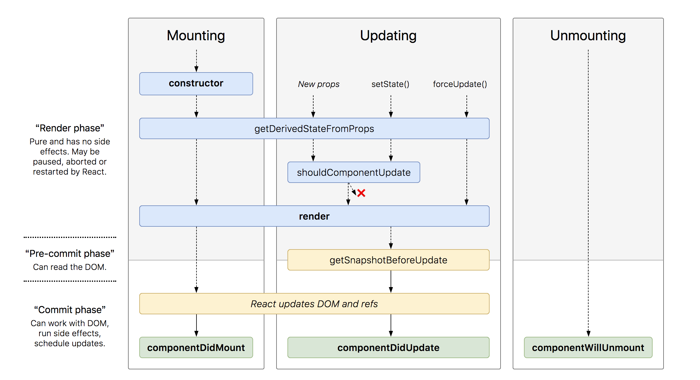

#  React

## V16 版本生命周期

### 生命周期图


### 用法建议 
```
class ExampleComponent extends React.Component {
  // 用于初始化 state
  constructor() {}
  // 用于替换 `componentWillReceiveProps` ，该函数会在初始化和 `update` 时被调用
  // 因为该函数是静态函数，所以取不到 `this`
  // 如果需要对比 `prevProps` 需要单独在 `state` 中维护
  static getDerivedStateFromProps(nextProps, prevState) {}
  // 判断是否需要更新组件，多用于组件性能优化
  shouldComponentUpdate(nextProps, nextState) {}
  // 组件挂载后调用
  // 可以在该函数中进行请求或者订阅
  componentDidMount() {}
  // 用于获得最新的 DOM 数据
  getSnapshotBeforeUpdate() {}
  // 组件即将销毁
  // 可以在此处移除订阅，定时器等等
  componentWillUnmount() {}
  // 组件销毁后调用
  componentDidUnMount() {}
  // 组件更新后调用
  componentDidUpdate() {}
  // 渲染组件函数
  render() {}
  // 以下函数不建议使用
  UNSAFE_componentWillMount() {}
  UNSAFE_componentWillUpdate(nextProps, nextState) {}
  UNSAFE_componentWillReceiveProps(nextProps) {}
}
```

### Mounting
在该阶段包含生命周期函数
* constructor()
* static getDerivedStateFromProps()
* render()
* componentDidMount()

#### constructor()
构造函数的作用有两个
一个通过分配对象来初始化本地状态this.state，另一个是将事件处理程序方法绑定到实例。
在构造函数中不用使用this.setState
```
constructor(props) {
  super(props);
  // Don't call this.setState() here!
  this.state = { counter: 0 };
  this.handleClick = this.handleClick.bind(this);
}
```
#### static getDerivedStateFromProps()

`static getDerivedStateFromProps(props, state)`

getDerivedStateFromProps在调用render方法之前调用，无论是在初始安装还是后续更新。它会返回一个对象去更新状态，或者返回null不更新任何东西

该生命周期是在16.3版本中新增的，当props或者state改变都会触发改生命周期，与这个相似的UNSAFE_componentWillReceiveProps()生命周期在之后的版本将会逐渐被替代，避免使用

#### render()
render()方法是类组件中唯一必需的方法。并且它是一个纯函数，意味着不会修改组件状态，每次调用时都返回相同的结果，并且它不直接与浏览器交互。
调用时它会校验this.state和this.props,然后返回下列的几种类型的返回值
* React elements
* Arrays and fragments
* Portals
* String and numbers
* Booleans or null

不能使用this.setState在该生命周期

#### componentDidMount() 

在该生命周期中可以进行dom的操作和数据的网络请求

### Updating
* static getDerivedStateFromProps()
* shouldComponentUpdate()
* render()
* getSnapshotBeforeUpdate()
* componentDidUpdate()
* UNSAFE_componentWillUpdate()
* UNSAFE_componentWillReceiveProps()

#### shouldComponentUpdate()

`shouldComponentUpdate(nextProps, nextState)`

shouldComponentUpdate 在接受到新的props和新的state的 在渲染之前会调用 默认的是返回true。该方法不会在初始的时候和使用forceUpdate()方法的时候调用。

在该生命周期中，可以进行性能的优化。也可以使用继承PureComponent组件，该组件已经对shouldComponentUpdate做了处理但是是浅比较。例如 state中有数组和对象时，你改变state的数组和对象它可能不会更新，不会深入的比较数组和对象。此时可以引入immutable.js进行结合使用。

### getSnapshotBeforeUpdate()

`getSnapshotBeforeUpdate(prevProps, prevState)`

在该生命周期中 state 已经更新，可以进行一些dom 操作，在render更新之前

### componentDidUpdate()

`componentDidUpdate(prevProps, prevState, snapshot)`

componentDidUpdate()更新发生后立即调用。初始渲染不会调用此方法。
该生命周期你也可以去操作dom，或者进行网络请求，当你发现props改变时。但是不能使用直接setState那样会导致无限循环，你可以再某种判断条件下使用。
如果组件使用了 getSnapshotBeforeUpdate()生命周期，则它返回的值将作为第三个“快照”参数传递给componentDidUpdate()。否则此参数将是未定义的。

###  UNSAFE_componentWillUpdate()

`UNSAFE_componentWillUpdate(nextProps, nextState)`

此生命周期之前已命名componentWillUpdate。该名称将继续有效，直到版本17.使用rename-unsafe-lifecyclescodemod自动更新组件。
UNSAFE_componentWillUpdate()在收到新的props或state时，在渲染之前调用。使用此作为在更新发生之前执行准备的机会。初始渲染不会调用此方法
不能再此使用this.setState

### UNSAFE_componentWillReceiveProps()

`UNSAFE_componentWillReceiveProps(nextProps)`

此生命周期之前已命名componentWillReceiveProps。该名称将继续有效，直到版本17.使用rename-unsafe-lifecyclescodemod自动更新组件。

该生命周期在初始化的时候不会被调用，只有当props被改变的时候会被调用,this.setState不会触发它

### Unmounting
* componentWillUnmount()

#### componentWillUnmount()
componentWillUnmount()在卸载和销毁组件之前立即调用。在此方法中执行任何必要的清理，例如使计时器无效，取消网络请求或清除在componentDidMount()其中创建的任何订阅。

不能调用setState()，componentWillUnmount()因为组件永远不会被重新呈现。卸载组件实例后，将永远不会再次mount它。

### Error Handling
* static getDerivedStateFromError()
* componentDidCatch()

#### static getDerivedStateFromError()

`static getDerivedStateFromError(error)`

在子组件抛出错误后会调用此生命周期。它接收作为参数抛出的错误，并返回值以更新状态。
在组件 “render” 阶段的时候就会被调用，不允许副作用

#### componentDidCatch()

`componentDidCatch(error, info)`

在子组件抛出错误的时候回调用此生命周期，它有2个参数，一个是错误，还有一个是对象，key对应的是错误来自哪个子组件。
该生命周期在 “ commit” 阶段调用所以可以有副作用

### Finally

#### 16 版本新增的生命周期 

* static getDerivedStateFromProps()
*  getSnapshotBeforeUpdate()
*  static getDerivedStateFromError()
* componentDidCatch()

#### 16 版本废除和减少使用的生命周期

* UNSAFE_componentWillUpdate()
* UNSAFE_componentWillReceiveProps()
* UNSAFE_componentWillMount()

#### this.setState 不能调用的生命周期

* constructor()
* render()
* componentDidUpdate() 不能直接使用
* UNSAFE_componentWillUpdate()
* UNSAFE_componentWillMount()

