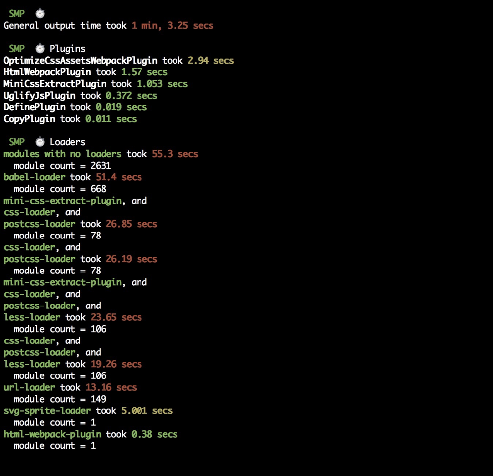

# Webpack

## 基础配置

本文就不过多的说明基础配置, 具体配置可查看[本链接](https://github.com/lewisYe/react-cli)

## 打包性能优化

### 速度分析

使用 `speed-measure-webpack-plugin` 插件

``` javascript
const SpeedMeasureWebpackPlugin = require('speed-measure-webpack-plugin')
const swp = new SpeedMeasureWebpackPlugin()

swp.warp({
    // webpack配置
})
```

使用warp方法将webpack配置包裹 [具体配置查看](https://www.npmjs.com/package/speed-measure-webpack-plugin)

效果如下图：


### 体积分析

使用 `webpack-bundle-analyzer` 插件

``` javascript
const BundleAnalyzerPlugin = require('webpack-bundle-analyzer').BundleAnalyzerPlugin;

module.exports = {
    plugins: [
        new BundleAnalyzerPlugin()
    ]
}
```

[具体配置查看](https://www.npmjs.com/package/webpack-bundle-analyzer)

###  优化方案

#### 使用高版本的webpack 和 node.js

比如webpack4 的打包速度就快于webpack3；node 的版本更高速度也会更快

webpack 优化原因

V8 带来的优化 使用for of 代替了forEach 、Map和Set代替了Object 、includes代替了indexOf

默认使用更快的md4 hash算法

webpacks AST可以直接从loader传递给 AST 减少传递时间

使用字符串代替正则表达式

#### 多进程/多实例构建

可以使用的插件有

* thread-loader
* parallel-webpack
* happypack

**HappyPack 用法**

``` javascript
const HappyPack = require('happypack');

exports.module = {
    rules: [{
        test: /.js$/,
        use: 'happypack/loader',
    }]
};

exports.plugins = [
    new HappyPack({
        loaders: ['babel-loader']
    })
];
```

该方法在webpack3中使用比较多，而且目前作者都不在维护该库，并推荐在webpack 4中使用 `thread-loader` 更多happypack配置查看[配置连接](https://www.npmjs.com/package/happypack)

**thread-loader 用法**

``` javascript
module.exports = {
    module: {
        rules: [{
            test: /\.js$/,
            include: path.resolve("src"),
            use: [{
                loader: "thread-loader",
                options: {
                    workers: 3,
                }
            }],
        }]
    }
}
```

[更多配置查看](https://www.npmjs.com/package/thread-loader)

#### 多进程并行压缩

* terser-webpack-plugin
* uglifyjs-webpack-plugin

#### 分包 与 预编译

DLLPlugin

vue-cli 和 create-react-app 抛弃了

也可以使用hard-source-webpack-plugin 来代替

#### 开启缓存

* babel-loader 开始缓存
* terser-webpack-plugin 开启缓存
* cache-loader 和 hard-source-webpack-plugin

#### 缩小构建目标

* babel-loader 的时候 不解析node_modules里面的内容 使用exclude
* 优化 resolve.modules 配置 缩小搜索范围层级
* 优化 resolve.mainFields 配置 查询入口文件
* 优化 resolve.extensions 后缀名
* 合理使用 resolve.alias

#### tree shaking 

* purgecss-webpack-plugin 去除无效css

#### 图片压缩

* image-webpack-loader

#### polyfill service优化构建体积

es6语法不兼容 需要使用到polyfill去转换

|方案|优点|缺点|推荐|
|:-:|:-:|:-:|:-:|
|babel-polyfill|react推荐|1.包体积200k+，难以单独抽离Map、Set|❎|
|babel-plugin-transform-runtime|能只polyfill用到的类和方法，相对体积小|不能polyfill原型上的方法，不能应用于复杂的业务场景|❎|
|自己写一个库|定制化、体积小|重复造轮子、需要更新维护|❎|
|polyfill-service|只给用户返回用到的polyfill、社区维护|国内奇葩浏览器UA不能识别、但可以降级处理返回全部的polyfill|✅|


https://polyfill.io/v3/ 官网

#### socpe hoisting

打包之后的作用域

## Writing a Loader

[文档链接](https://webpack.js.org/contribute/writing-a-loader/)

开发插件中一般会用到的工具库 `loader-utils` 和 `schema-utils`

`loader-utils` 有很多工具类方法 [具体配置项链接](https://github.com/webpack/loader-utils)

`schema-utils`用于参数校验

可以直接return 单个结果  多个结果可以使用`this.callback(err, values...)`

比如实现一个中文转unicode

## Writing a Plugin

开发一个插件 必须是一个类，类中必须有一个apply 方法。 apply方法会有一个`complier`参数。

然后通过监听hooks 进行操作 比如监听emit hook
```javascript
 complier.hooks.emit.tapAsync('MyPlugin',(compilation,callback)=>{
     // 插件功能
 })
```

[文档链接](https://webpack.js.org/contribute/writing-a-plugin/)
